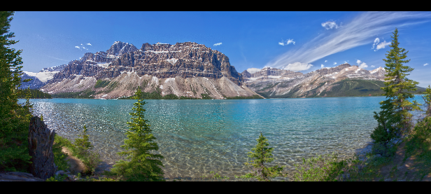
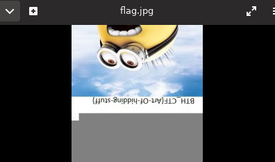

# Eye in the sky

I'm the author of this challenge. This is my thoughts on how to solve the challenge.


We are given a nice picture, but no flag.


File name looks like base64.

`echo Uk9QRSAyIEAgIyBvbWVsZXQgSkFDSwo | base64 -d`
 
```
ROPE 2 @ # omelet JACK
```

WTF? This make no sense. Maybe it could be some password of some sort?

At this point, just save it in a note and move on.

(Author note: This is just some bullshit password I generated and put there to confuse people. Sorry if you went down this rabbit hole)

Running binwalk on the file we see some more data appended to the file.

```
DECIMAL       HEXADECIMAL     DESCRIPTION
--------------------------------------------------------------------------------
0             0x0             JPEG image data, JFIF standard 1.01
382           0x17E           Copyright string: "Copyright (c) 1998 Hewlett-Packard Company"
5905194       0x5A1B2A        JPEG image data, JFIF standard 1.01
5905224       0x5A1B48        TIFF image data, big-endian, offset of first image directory: 8
```

You can use `binwalk --dd='.*' Uk9QRSAyIEAgIyBvbWVsZXQgSkFDSwo.jpg` or `foremost Uk9QRSAyIEAgIyBvbWVsZXQgSkFDSwo.jpg` to extract the additional files.


Cool! A new image.

The extract image size is quite low:

`-rw-rw-r-- 1 flaw flaw  21K apr 29 19:15 00011533.jpg`

Running stegsolve is a dead end. Nothing in strings or exifdata. 

For image files there is possible to hide information outside the size of the image. This is quite common in CTF challenges.

You can manually hexedit the height of the image or use a tool I've written ([modsize](https://github.com/flawwan/modsize))

```
$ python modsize.py --height 00011533.jpg flag.jpg
[*] Detected: jpg
[*] Found magic bytes on offset 195 
[+] modsize: Image loaded!
0x11c
[*] Detected width: 284 px
[*] Detected height: 150 px
[*] New width: 284 px
[*] New height: 1000 px
[+] modsize: Image saved!
```


