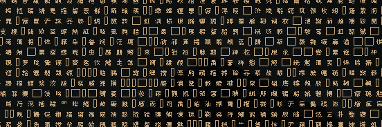
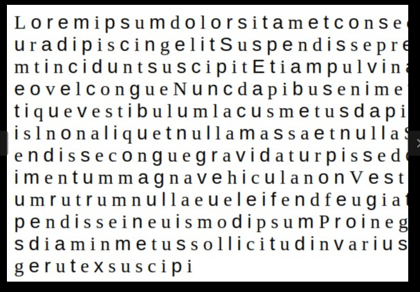

# Lost in the jungle 

I'm the author of this challenge. This is my thoughts on how to solve the challenge.


We are given a iso file.

```
$ file jungle.iso 
jungle.iso: ISO 9660 CD-ROM filesystem data 'CDROM'
```

Let's mount the file and see what we have.

`sudo mount -o loop jungle.iso /mnt/usb`

``` 
/mnt/usb$ ls
jungle.zip
/mnt/usb$ file jungle.zip 
jungle.zip: Zip archive data, at least v1.0 to extract
```

We have a zip. Let's extract it.

Unzipping the file we get a ton of segments...

```
segment001    segment00164  segment00229  segment00294  segment00359  segment00423
segment0010   segment00165  segment0023   segment00295  segment0036   segment00424
segment00100  segment00166  segment00230  segment00296  segment00360  segment00425
segment00101  segment00167  segment00231  segment00297  segment00361  segment00426
segment00102  segment00168  segment00232  segment00298  segment00362  segment00427
segment00103  segment00169  segment00233  segment00299  segment00363  segment00428
segment00104  segment0017   segment00234  segment003    segment00364  segment00429
segment00105  segment00170  segment00235  segment0030   segment00365  segment0043
segment00106  segment00171  segment00236  segment00300  segment00366  segment00430
segment00107  segment00172  segment00237  segment00301  segment00367  segment00431
segment00108  segment00173  segment00238  segment00302  segment00...
```

Each segment has some data in it (segment 1)

```
output/segment001/6CJYJPHJWG3PBFEUUDU2LKPJ/WW2OLHF5422LLZM4WDU3JIHJ/XGS6TNNH46E3JZVEULTJJMHF/............
```

We see segment00001 to segment00431. Each folder contain data hidden in folder names.

If we open the last segment and type `cd segment00431 && find .` we get the following data:

```
...XTJBIXD/XC7OPBFA5GYK7Y5YX3TJBPHQ/SSI3HZ4NU4======
```

Some people might confuse this data as base64, but it's actually base 32.

```
echo -n "hejsan" | base32
NBSWU43BNY======
```

Base64 data only end with 0,1,2 equal signs.

Putting all the segments together:

```
#!/usr/bin/python

import os

segments = []

for segment in range(1, 434):
	for root, dirs, files in os.walk("./output/output/segment00" + str(segment) + "/"):
		path = root.split(os.sep)
		segment = os.path.basename(root)
		segments.append(segment)


print "".join(segments)
```

Cat the data to a file.

```
python verify.py > base32data
```

```
cat base32data | base32 -d > new_data
```

When view cat the file we get a bunch of chinese letters.
This is highly likely to be base65536 (https://github.com/qntm/base65536) when you see a lot of chinese letters.



```
cat new_data |  base65536 -d > more_data
```

```
$ file more_data 
more_data: SVG Scalable Vector Graphics image
```

Opening the svg file we get a picture of some dude.


Reverse image search gives us:


Googling this guy we find out this:

```
The first sans serif font to appear in a type sample book was by William Caslon IV in 1816.
```

But where is the flag? 

SVG files are editable. Let's open the file in vim and remove the dude and see if there is something hidden below.



If you look closely, you will notice that the font for the text seem to alternate between serif and sans-serif.

Could this be a binary message?

```
100001001010100010010000101111101000011010101000100011001111011011010000110100101100100011001000110010101101110001011010110110101100101011100110111001101100001011001110110010100101101011010010110111000101101011001000110100101100110011001100110010101110010011001010110111001110100001011010110011001101111011011100111010001110011001011100110111001101001011000110110010101111101
```

Decoding this binary:

```
import binascii
n = int('0b100001001010100010010000101111101000011010101000100011001111011011010000110100101100100011001000110010101101110001011010110110101100101011100110111001101100001011001110110010100101101011010010110111000101101011001000110100101100110011001100110010101110010011001010110111001110100001011010110011001101111011011100111010001110011001011100110111001101001011000110110010101111101', 2) 
print binascii.unhexlify('%x' % n)
```

Running the script we get the flag:

```
BTH_CTF{hidden-message-in-different-fonts.nice}
```
