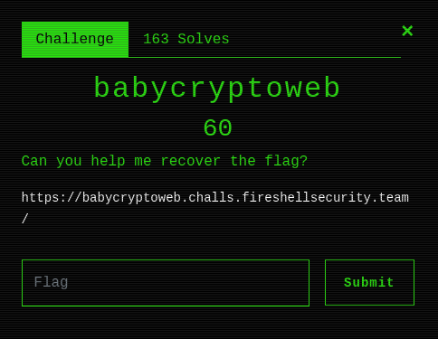

# babycryptoweb (Web, Crypto)

Hi CTF player. If you have any questions about the writeup or challenge. Submit a issue and I will try to help you understand.

Also I might be wrong on some things. Enjoy :)

(P.S Check out my [CTF cheat sheet](https://github.com/flawwan/CTF-Candy))



We are presented with the source code of the script.

```php
<?php

$code = '$kkk=5;$s="e1iwZaNolJeuqWiUp6pmo2iZlKKulJqjmKeupalmnmWjVrI=";$s=base64_decode($s);$res="";for($i=0,$j=strlen($s);$i<$j;$i++){$ch=substr($s,$i,1);$kch=substr($kkk,($i%strlen($kkk))-1,1);$ch=chr(ord($ch)+ord($kch));$res.=$ch;};echo $res;';
    
if (isset($_GET['p']) && isset($_GET['b']) && strlen($_GET['b']) === 1 && is_numeric($_GET['p']) && (int) $_GET['p'] < strlen($code)) {
    $p = (int) $_GET['p'];
    $code[$p] = $_GET['b'];
    eval($code);
} else {
    show_source(__FILE__);
}

?>    
```

Looking at the code it looks kinda confusing at first. Let's save a local copy and work with it instead so we can debug what is going on.

First, let's refactor the `$code` variable and see what it does.

```php
<?php

$kkk=5;
$s="e1iwZaNolJeuqWiUp6pmo2iZlKKulJqjmKeupalmnmWjVrI=";
$s=base64_decode($s);
$res="";
for($i=0;$i<strlen($s);$i++){
    $ch=substr($s,$i,1); 
    $kch=substr($kkk,($i%strlen($kkk))-1,1);
    $ch=chr(ord($ch)+ord($kch));
    $res.=$ch;
}
echo $res;
```

Looking at this line `$ch=chr(ord($ch)+ord($kch));`.
It seems like a substitution cipher, where each letter is shifted x positions. We can just reverse it by changing the `+` to a `-`.

`get_flag.php`
```php
<?php

$kkk=5;
$s="e1iwZaNolJeuqWiUp6pmo2iZlKKulJqjmKeupalmnmWjVrI=";
$s=base64_decode($s);
$res="";
for($i=0;$i<strlen($s);$i++){
    $ch=substr($s,$i,1); 
    $kch=substr($kkk,($i%strlen($kkk))-1,1);
    $ch=chr(ord($ch)-ord($kch));
    $res.=$ch;
}
echo $res;
```

...And running it with `php get_flag.php` and we get our flag: 

`F#{0n3_byt3_ru1n3d_my_encrypt1i0n!}`