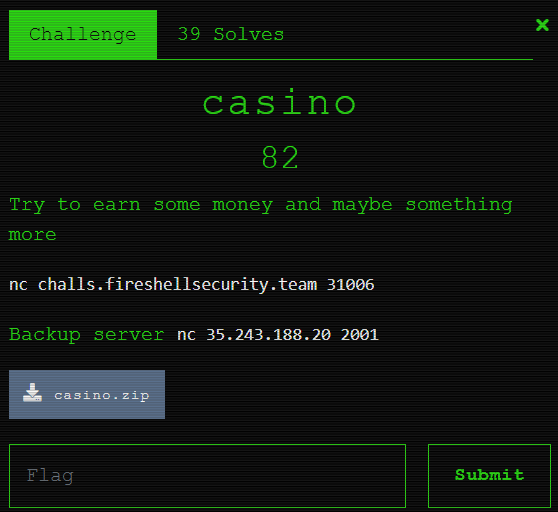
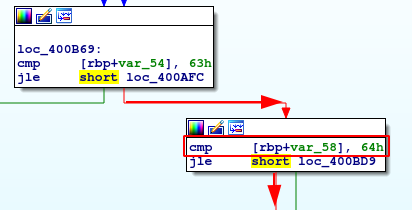
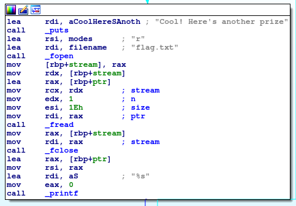

# casino (Pwn)

Hi CTF player. If you have any questions about the writeup or challenge. Submit a issue and I will try to help you understand.

Also I might be wrong on some things. Enjoy :)

(P.S Check out my [CTF cheat sheet](https://github.com/flawwan/CTF-Candy))



This was quite a challenge and with the help of my two friends @happysox and @fredrikhelgessoon we managed to solve the challenge just in time before the CTF ended.

## Static analysis

```bash
$ file casino 
casino: ELF 64-bit LSB executable, x86-64, version 1 (SYSV), dynamically linked, interpreter /lib64/ld-linux-x86-64.so.2, for GNU/Linux 3.2.0, BuildID[sha1]=22932a2fa861f5770e04551d31ec06920c270c5b, not stripped
```

```
$ checksec casino
[*] '/home/flaw/CTF/events/fireshell/casinoroyale/casino'
    Arch:     amd64-64-little
    RELRO:    Full RELRO
    Stack:    Canary found
    NX:       NX enabled
    PIE:      No PIE (0x400000)
```

#### Summary:

* 64 bit executable
* All protections enabled except pie.

## Play time

```bash
$ ./casino 
What is your name? Richard
Welcome Richard
M
 @
[1/100] Guess my number: 5
Sorry! It was not my number
```

Looks like we have to guess 100 numbers in a row to get the flag... Let's begin reversing the binary. 

We quickly find that the binary is using `rand` and `srand`.

The man page states the following for `srand`.

```
The srand() function sets its argument as the seed for a new sequence  of
       pseudo-random  integers  to  be  returned by rand().  These sequences are
       repeatable by calling srand() with the same seed value.
```

If we can reverse engineer how the seed is generated we can predict the number sequence. I will use `gdb` for this task mainly.

```bash
$ gdb -q casino
$ pdisass main
```

```asm
0x0000000000400a60 <+33>:    mov    edi,0x0
0x0000000000400a65 <+38>:    call   0x400890 <time@plt>
0x0000000000400a6a <+43>:    mov    DWORD PTR [rbp-0x50],eax
0x0000000000400a6d <+46>:    mov    eax,DWORD PTR [rbp-0x50]
0x0000000000400a70 <+49>:    mov    edx,0xcccccccd
0x0000000000400a75 <+54>:    mul    edx
0x0000000000400a77 <+56>:    mov    eax,edx
0x0000000000400a79 <+58>:    shr    eax,0x3
0x0000000000400a7c <+61>:    mov    DWORD PTR [rbp-0x50],eax ; store it in rbp-0x50

...
```

Psuedo code will look something like this:

```
seed = time(0) * 0xcccccccd
lower_bits = get the lower bits of seed
seed = seed >> 3
```

If we look closer to the srand call:

```asm
   0x0000000000400ad2 <+147>:   mov    eax,DWORD PTR [rip+0x201548] # x602020 <bet>
   0x0000000000400ad8 <+153>:   add    DWORD PTR [rbp-0x50],eax
   0x0000000000400adb <+156>:   mov    eax,DWORD PTR [rbp-0x50]
   0x0000000000400ade <+159>:   mov    edi,eax
   0x0000000000400ae0 <+161>:   call   0x400870 <srand@plt>
```

It seems like it fetched something from `0x602020`. 

```asm
gdb-peda$ x/wx 0x602020
0x602020 <bet>: 0x00000001
```

So the value is 1. The final psuedo code looks like this.

```
seed = time(0) * 0xcccccccd
lower_bits = get the lower bits of seed
seed = seed >> 3
seed = seed + 1
```

## Predicting the "random" number sequence

We now have everything we need to create the same seed and thus generate the number sequence.

```
#include <stdio.h>
#include <time.h>
#include <stdlib.h>
#include <unistd.h>

int main(){
    int foo= time(0);
    int bar = 0xcccccccd;

    //Inline assembly, cuz why not D:::
    int upper; //https://stackoverflow.com/questions/42264712/multiplication-instruction-error-in-inline-assembly
    __asm__ ("mul %%ebx"
         :"=a"(foo), "=d"(upper)
         :"a"(foo), "b"(bar)
         :"cc"
    );  
    int win = (upper >> 0x3) + 1;
    srand(win);
    
    for (int i = 0; i < 100; i++){
        int a = rand();
        printf("%d\n", a);  
    }

    return 0;
}
```

Compile the solve program:

```
gcc -o solve solve.c
```

We can now use some bash magic to automate the process of entering all numbers.

```bash
(echo "AAAAA"; ./solve )
```

* First we need to take care of the username. We will first echo "AAAAA" into the program with a newline to simulate the enter keypress. 
* ./solve. Solve program will type out all numbers.

Combining it all together: 
```bash
(echo "AAAAA"; ./solve )  | ./casino 
What is your name? Welcome AAAAA

[1/100] Guess my number: Correct!
[2/100] Guess my number: Correct!
[3/100] Guess my number: Correct!
[4/100] Guess my number: Correct!
[5/100] Guess my number: Correct!
[6/100] Guess my number: Correct!
[7/100] Guess my number: Correct!
[8/100] Guess my number: Correct!
[9/100] Guess my number: Correct!
[10/100] Guess my number: Correct!
[11/100] Guess my number: Correct!
[12/100] Guess my number: Correct!
[13/100] Guess my number: Correct!
[14/100] Guess my number: Correct!
[15/100] Guess my number: Correct!
[16/100] Guess my number: Correct!
[17/100] Guess my number: Correct!
[18/100] Guess my number: Correct!
[19/100] Guess my number: Correct!
[20/100] Guess my number: Correct!
[21/100] Guess my number: Correct!
[22/100] Guess my number: Correct!
[23/100] Guess my number: Correct!
[24/100] Guess my number: Correct!
[25/100] Guess my number: Correct!
[26/100] Guess my number: Correct!
[27/100] Guess my number: Correct!
[28/100] Guess my number: Correct!
[29/100] Guess my number: Correct!
[30/100] Guess my number: Correct!
[31/100] Guess my number: Correct!
[32/100] Guess my number: Correct!
[33/100] Guess my number: Correct!
[34/100] Guess my number: Correct!
[35/100] Guess my number: Correct!
[36/100] Guess my number: Correct!
[37/100] Guess my number: Correct!
[38/100] Guess my number: Correct!
[39/100] Guess my number: Correct!
[40/100] Guess my number: Correct!
[41/100] Guess my number: Correct!
[42/100] Guess my number: Correct!
[43/100] Guess my number: Correct!
[44/100] Guess my number: Correct!
[45/100] Guess my number: Correct!
[46/100] Guess my number: Correct!
[47/100] Guess my number: Correct!
[48/100] Guess my number: Correct!
[49/100] Guess my number: Correct!
[50/100] Guess my number: Correct!
[51/100] Guess my number: Correct!
[52/100] Guess my number: Correct!
[53/100] Guess my number: Correct!
[54/100] Guess my number: Correct!
[55/100] Guess my number: Correct!
[56/100] Guess my number: Correct!
[57/100] Guess my number: Correct!
[58/100] Guess my number: Correct!
[59/100] Guess my number: Correct!
[60/100] Guess my number: Correct!
[61/100] Guess my number: Correct!
[62/100] Guess my number: Correct!
[63/100] Guess my number: Correct!
[64/100] Guess my number: Correct!
[65/100] Guess my number: Correct!
[66/100] Guess my number: Correct!
[67/100] Guess my number: Correct!
[68/100] Guess my number: Correct!
[69/100] Guess my number: Correct!
[70/100] Guess my number: Correct!
[71/100] Guess my number: Correct!
[72/100] Guess my number: Correct!
[73/100] Guess my number: Correct!
[74/100] Guess my number: Correct!
[75/100] Guess my number: Correct!
[76/100] Guess my number: Correct!
[77/100] Guess my number: Correct!
[78/100] Guess my number: Correct!
[79/100] Guess my number: Correct!
[80/100] Guess my number: Correct!
[81/100] Guess my number: Correct!
[82/100] Guess my number: Correct!
[83/100] Guess my number: Correct!
[84/100] Guess my number: Correct!
[85/100] Guess my number: Correct!
[86/100] Guess my number: Correct!
[87/100] Guess my number: Correct!
[88/100] Guess my number: Correct!
[89/100] Guess my number: Correct!
[90/100] Guess my number: Correct!
[91/100] Guess my number: Correct!
[92/100] Guess my number: Correct!
[93/100] Guess my number: Correct!
[94/100] Guess my number: Correct!
[95/100] Guess my number: Correct!
[96/100] Guess my number: Correct!
[97/100] Guess my number: Correct!
[98/100] Guess my number: Correct!
[99/100] Guess my number: Correct!
```

No flag???????? Ehhh?!?!?!??

Checking the graph view it seems like we fail the second compare.



If the second compare were to succeed we would jump to the win function and get the flag.




Looking some more in gdb I found out that the value is initalized as zero.

```asm
mov    DWORD PTR [rbp-0x58],0x0
```

And then looking at the compare
```asm
0x0000000000400b5c <+285>:   mov    eax,DWORD PTR [rip+0x2014be]        # 0x602020 <bet>
0x0000000000400b62 <+291>:   add    DWORD PTR [rbp-0x58],eax
0x0000000000400b65 <+294>:   add    DWORD PTR [rbp-0x54],0x1
0x0000000000400b69 <+298>:   cmp    DWORD PTR [rbp-0x54],0x63
0x0000000000400b6d <+302>:   jle    0x400afc <main+189>
0x0000000000400b6f <+304>:   cmp    DWORD PTR [rbp-0x58],0x64
0x0000000000400b73 <+308>:   jle    0x400bd9 <main+410>
```

This code is basically incrementing `rbp-0x58` with the `bet` value that we saw earlier.

To sum it up:

* Initalize var58 = 0 (rbp-0x58)
* For each correct solve, increment var58 with the value of `bet`.
* This value will be 99 when we have entered 100 correct numbers.

So the condition will always fail as `99 <= 100`.

This is where I got stuck and my time ran out. So I sent all the code that I had to my teammate @happysox.

**Part two coming soon**