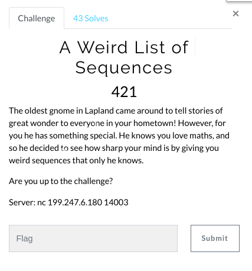
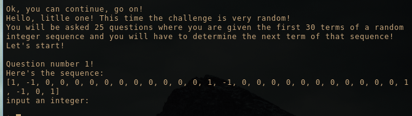
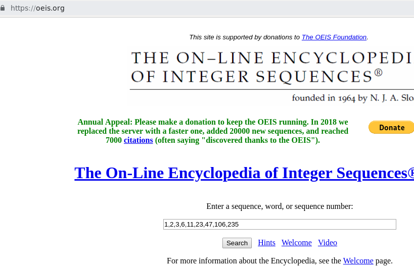

# A Weird List of Sequences (Misc)

Hi CTF player. If you have any questions about the writeup or challenge. Submit a issue and I will try to help you understand.

Also I might be wrong on some things. Enjoy :)

(P.S Check out my [CTF cheat sheet](https://github.com/flawwan/CTF-Candy))

Connecting to the netcat server we get a prompt saying we need to supply a captcha code.

Using pwntools and a simple md5 bruteforce script we quickly crack the captcha.

Script available here: [brute.py](brute.py)

After cracking the captcha, we can start the challenge.

Okay we have to predict the number sequence 25 times. Doing it by hand is quite hard. Let's use `oeis.org`.

Again manually typing all these numbers in to the website is boring. Also there might be a timeout (untested). Automating the process with python is easier and more fun. Let's do that.

### Creating a automatic tool to solve the task

Our goal is to:
* Bruteforce the captcha
* Parse the given number sequence.
* Send the number sequence to oeis.org.
* Fetch the next predicted number from the response of oeis.org.
* Send the number to the server.
* Loop 25 times.
* Get the flag

With this python script I used the following libraries:
* Pwntools - Connect to challenge server over tcp.
* requests - To send GET request to oeis.org
* pyquery - Parsing the response of oeis.org to get the next predicted number
* hashlib - md5 encode function

Full script available here: [solve.py](solve.py)

Running the script, we get the flag after 25 solved sequences! Cool

