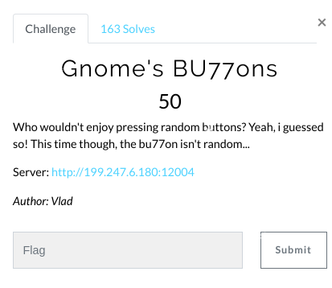
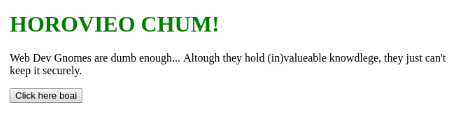
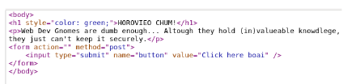
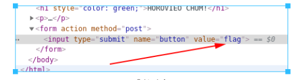
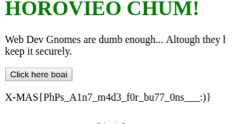

# Gnome's BU77ons (Web)

Hi CTF player. If you have any questions about the writeup or challenge. Submit a issue and I will try to help you understand.

Also I might be wrong on some things. Enjoy :)

(P.S Check out my [CTF cheat sheet](https://github.com/flawwan/CTF-Candy))

The website was simple. Only a button that seemed to do nothing.

Nothing interesting in the html.

After trying a lot of stupid things. I tried to just type "flag" as the value of the button and submitted it.

And finally got the flag.

Did not like this challenge. Was just a guessing game..
