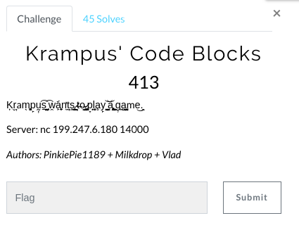
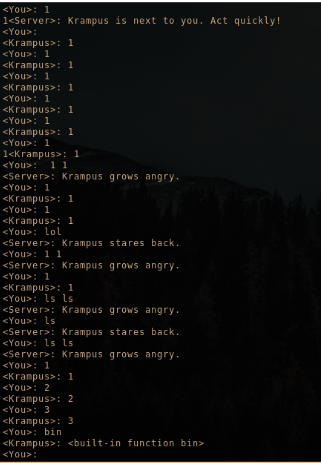
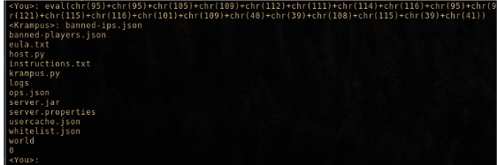
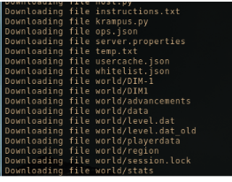
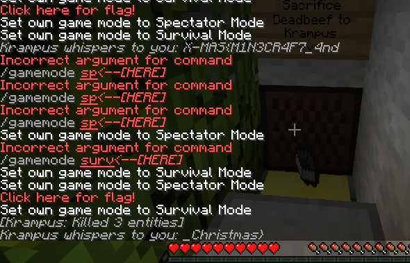
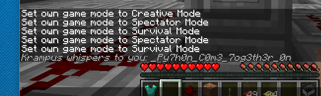

# Krampus' Code Blocks (Web)

Hi CTF player. If you have any questions about the writeup or challenge. Submit a issue and I will try to help you understand.

Also I might be wrong on some things. Enjoy :)

(P.S Check out my [CTF cheat sheet](https://github.com/flawwan/CTF-Candy))



After connecting to the nc server. You will talk with Krampus.

Playing around with the game:



At the bottom. That looks exactly like python. From experience this is a sandbox escape.

I noticed eval was available, but most of the commands where blocked.

Translating payload to chr's we bypassed the regex and can send a arbitrary string to eval.

```
def convertstr(convert):
	output = ""
	for i in convert:
		output+= "chr(%d)+" % ord(i)
	return output[:-1]
```
Then we can send our payload as such:



No flag.txt... These files look like a minecraft server. Let's write a script to download all files.

[solve.py](solve.py)



Running the server.jar with the following commands:

`java -Xmx1024M -Xms1024M -jar server.jar`

Connecting to the minecraft server we enter a map. And we have to search for the flag.





And we get the final flag:

`X-MAS{M1N3CR4F7_4nd_Py7h0n_C0m3_7og3th3r_0n_Christmas}`
