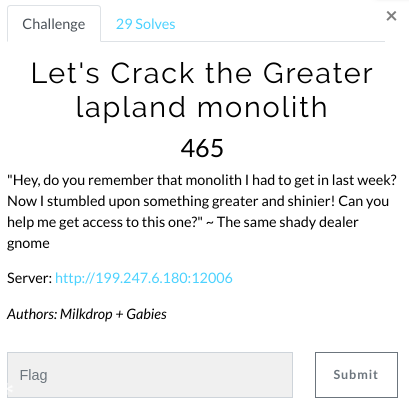
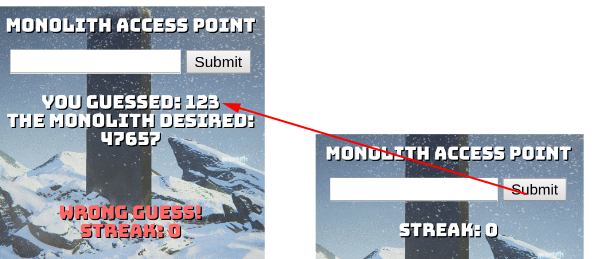
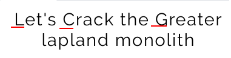

# Let's Crack the Greater lapland monolith (Web/Crypto)

Hi CTF player. If you have any questions about the writeup or challenge. Submit a issue and I will try to help you understand.

Also I might be wrong on some things. Enjoy :)

(P.S Check out my [CTF cheat sheet](https://github.com/flawwan/CTF-Candy))

The challenge is basically predicting the next number by only knowing the previous number.

The challenge author told us in discord that it's not time based.

When I stared at the title I noticed L.C.G.

`A linear congruential generator (LCG) is an algorithm that yields a sequence of pseudo–randomized numbers` - Wikipedia

Cool this must be it!!!

I found this awesome page describing everything about LCG and how you can easily break it from a few numbers in a sequence.

https://tailcall.net/blog/cracking-randomness-lcgs/

Solve script available here [solve.py](solve.py)

And we get the flag:
`X-MAS{LCG_0n_7h3_LapL4nd_m0n0LiTh_1s_n0t_7ha7_s3cur3}`

There was a unintended solution for this challenge. So the challenge author fixed that unintended solution and made another challenge called "Let's Crack the Greater lapland monolith".

The challenge was the same and I just changed the port in the above script and got another flag.

`X-MAS{Bru73_F0rc3_1s_gr34t_bu7_LCG_1s_b3tt3r___}`
