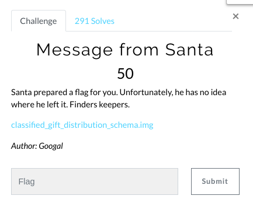
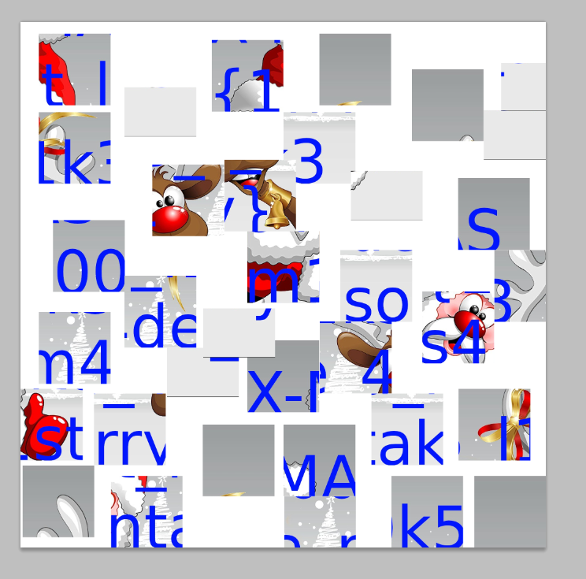
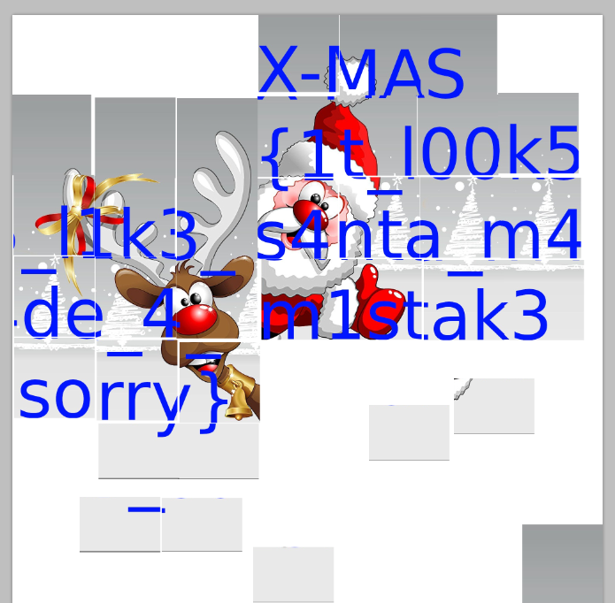

# Message from Santa (Forensics)

Hi CTF player. If you have any questions about the writeup or challenge. Submit a issue and I will try to help you understand.

Also I might be wrong on some things. Enjoy :)

(P.S Check out my [CTF cheat sheet](https://github.com/flawwan/CTF-Candy))



We are given a .img file.

Let's see what it is by running `file`

```
$ file classified_gift_distribution_schema.img
classified_gift_distribution_schema.img: DOS/MBR boot sector, code offset 0x3c+2, OEM-ID "mkfs.fat", sectors/cluster 4, reserved sectors 4, root entries 512, sectors 20480 (volumes <=32 MB), Media descriptor 0xf8, sectors/FAT 20, sectors/track 62, heads 63, hidden sectors 2048, serial number 0x75b1a735, label: "usb        ", FAT (16 bit)
```

It's seems like it's FAT16.

We can mount the iso with:

`$ sudo mount -t vfat classified_gift_distribution_schema.img /mnt/usb
`

Browsing the files at /mnt/usb we find a innocent looking snowman called "grep.jpeg".

Browsing the hidden files with `ls -la` we find a hidden folder called `.Trash-0`.
Inside the folder are small images creating a puzzle of the flag.

Opening all the images in photoshop using the `Place` command to import all images as new layers.



Then it's just a puzzle we need to solve. Using [CTRL] you can easily move images around.

After some time, this is the final image.



(The reindeer should be on the right of santa :p Got the flag anyways)

Flag is `X-MAS{1t_l00k5_l1k3_s4nta_m4de_4_m1stak3_sorry}`
