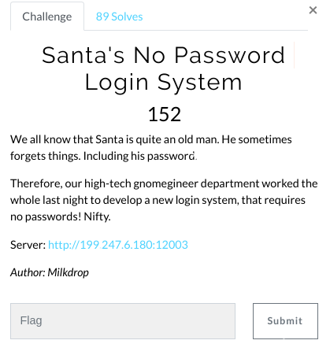
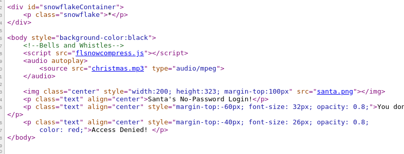
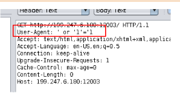
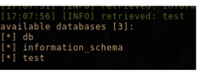
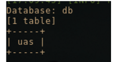
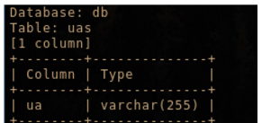
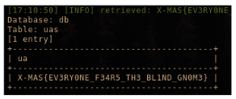

# Santa's No Password Login System (Web)

Hi CTF player. If you have any questions about the writeup or challenge. Submit a issue and I will try to help you understand.

Also I might be wrong on some things. Enjoy :)

(P.S Check out my [CTF cheat sheet](https://github.com/flawwan/CTF-Candy))



The website looks like this:


Nothing interesting in the source of the website.



With this information I am certain we should either inject stuff in the Referer header or the user agent header.

I tried fuzzing the Referer with common user agents but no luck there. Moving on to the user agent header.

First I wrote my own fuzz tool to target the user-agent header. No fun in using ZAP:p.


Script available here [script.py](script.py)


After a few seconds the program stopped and said:

```
[y] Success, ' or '1'='1
```

Now it says welcome instead of access denied. This means we have a sql injection.

Let's verify it with ZAP.




Cool. Let's fire up `sqlmap` and dump the tables.

### Using SQLmap to target User-Agent.

```
$ sqlmap -u "http://199.247.6.180:12003/" --level 3 --random-agent --dbs
```

* This will use a random user agent as the sqlmap user agent was blocked by the server.
* level 3 is used to target the Referer and user-agent header.

Running the script we can speed things up by pressing [CTRL-C] as sqlmap will first try to exploit the Referer header. We know the sqli is in the user-agent field. Now press [n] for next parameter which will be our user-agent.



Cool we have the databases for the mysql database.

Now we can dump the tables of db.



And then we dump the columns of the uas table.



And finally we dump the content of the uas table.


