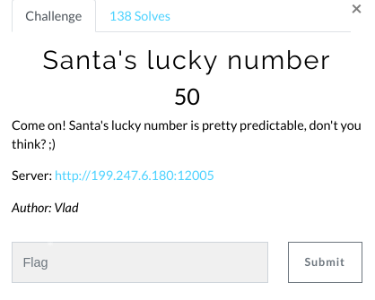
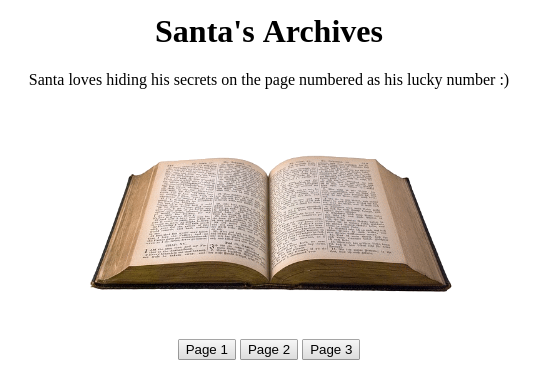
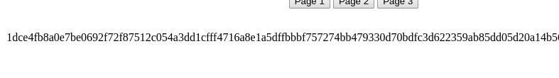

# Santa's lucky number (Web)

Hi CTF player. If you have any questions about the writeup or challenge. Submit a issue and I will try to help you understand.

Also I might be wrong on some things. Enjoy :)

(P.S Check out my [CTF cheat sheet](https://github.com/flawwan/CTF-Candy))



This is the website.



Clicking on one of the buttons give us a random string.



Decoding it as hex/base64 did not do much. Just garbage.

The challenge states that santa hides his secret on his lucky number.

* A book can only have positive pages

Let's bruteforce this and print all weird strings.

```python
import requests
import re
from pyquery import PyQuery as pq
import base64
import time

data = ""
for i in range(0,2000):
	r = requests.get("http://95.179.163.167:12005/?page=" + str(i))
	d = pq(r.text)
	unknown_line = d("p:nth-child(3)").text()
	print "%d - %s" % (i, unknown_line)
```

Writing the output to a file and grepping for the flag.

```bash
$ cat output | grep -i x-mas
1327 - X-MAS{W00pS_S0m30n3_73l1_S4n7a_h1s_c00k1eS_Ar3_BuRn1ng}
```

We find the flag on page 1327.
