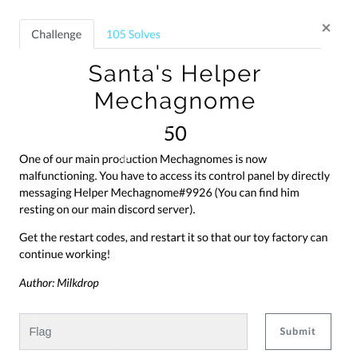
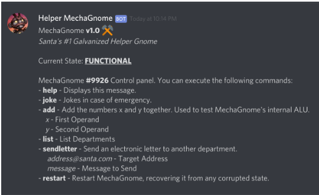
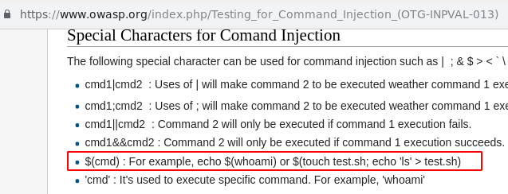
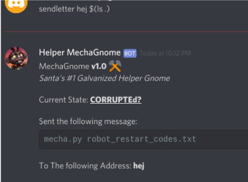
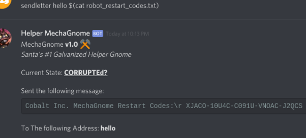
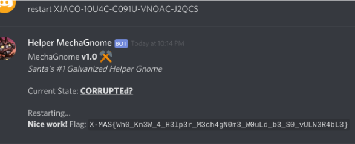

# Santa's Helper Mechagnome (Web)

Hi CTF player. If you have any questions about the writeup or challenge. Submit a issue and I will try to help you understand.

Also I might be wrong on some things. Enjoy :)

(P.S Check out my [CTF cheat sheet](https://github.com/flawwan/CTF-Candy))

This was a interesting challenge. In the XMAS-2018 discord server there was a Discord bot by the name "Mechagnome#9926". We are told we should get the restart codes to get the flag.

Typing help we get a list of commands we can use to talk to the bot.

Playing around with the commands I concluded there are a few commands that we can't exploit due to the fact they take no user input.

* help
* joke
* list

We can also exclude the `restart` command for now as we do not have the restart codes yet.

This leaves us with the following two commands that we might be able to exploit.

* add <x> <y>
* sendletter <to> <message>

Playing around with the add command, it seem to handle very big numbers. Does not seem to be any overflows or weird things. Only accept numbers which leaves us with the last command, `sendletter`.

I often use OWASP as my resource when exploiting web applications. Looking at the command injection and manually trying each. We find that the second parameter `message` is vulnerable to a command injection.

Now when we acquired the restart codes we get the flag by issuing the `restart` command with the codes.

And the flag:

Cool challenge! Thanks @milkdrop
