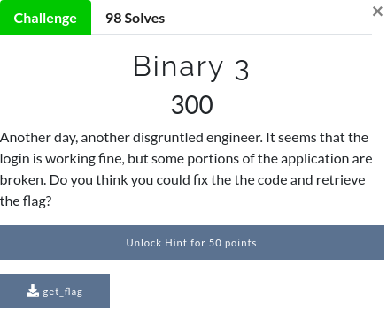
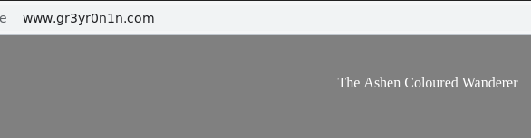
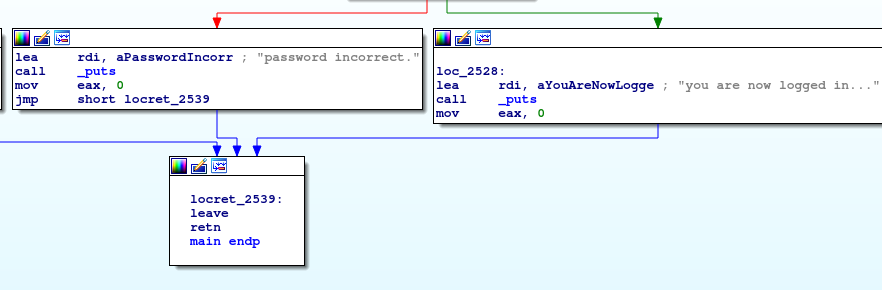
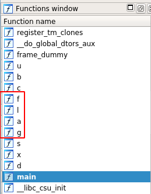
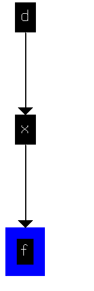
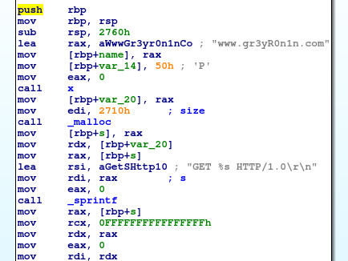
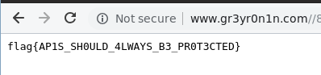
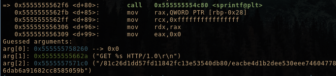

# Binary 3 (Reverse)

Hi CTF player. If you have any questions about the writeup or challenge. Submit a issue and I will try to help you understand.

Also I might be wrong on some things. Enjoy :)

(P.S Check out my [CTF cheat sheet](https://github.com/flawwan/CTF-Candy))



## Static analysis

```bash
$ file get_flag
get_flag: ELF 64-bit LSB pie executable, x86-64, version 1 (SYSV), dynamically linked, interpreter /lib64/ld-linux-x86-64.so.2, for GNU/Linux 3.2.0, BuildID[sha1]=9d6e0012cc1b18b155cb8f490eb1fbed910694e2, not stripped
```

```
$ strings get_flag
...
admin
username: 
password: 
www.gr3yR0n1n.com
GET %s HTTP/1.0
username incorrect.
password incorrect.
you are now logged in...
...
```

We see two interesting strings `admin`, `www.gr3yR0n1n.com` and `GET %s HTTP/1.0`.

* admin is probably the username
* Seems like it performs a GET requests to www.gr3yR0n1n.com.

Browsing that website gives us nothing:



## Play time

```
$ ./get_flag 
username: asdasd
username incorrect.

$ ./get_flag 
username: admin
password: ..
```

Admin seem to be the correct username. Let's figure out the correct password by opening gdb.

```
RSI: 0x7fffffffdea0 ("password")
RDI: 0x555555757180 ("a2VlcCBsb29raW5nLCBub3QgdGhlIGZsYWc=")
RBP: 0x7fffffffdfd0 --> 0x555555556540 (<__libc_csu_init>:  push   r15)
RSP: 0x7fffffffdfb0 --> 0x7fffffffe0b8 --> 0x7fffffffe3d9 ("/binary3/get_flag")
RIP: 0x55555555650f (<main+83>: cmp    DWORD PTR [rbp-0x4],0x0)
R8 : 0x555555556600 ("username: ")
R9 : 0x7ffff7fa3500 (0x00007ffff7fa3500)
R10: 0x7ffff7fa3500 (0x00007ffff7fa3500)
R11: 0x246 
R12: 0x555555554cc0 (<_start>:  xor    ebp,ebp)
R13: 0x7fffffffe0b0 --> 0x1 
R14: 0x0 
R15: 0x0
EFLAGS: 0x282 (carry parity adjust zero SIGN trap INTERRUPT direction overflow)
[-------------------------------------code-------------------------------------]
   0x555555556502 <main+70>:    mov    eax,0x0
   0x555555556507 <main+75>:    call   0x555555554e42 <b>
   0x55555555650c <main+80>:    mov    DWORD PTR [rbp-0x4],eax
=> 0x55555555650f <main+83>:    cmp    DWORD PTR [rbp-0x4],0x0
   0x555555556513 <main+87>:    jne    0x555555556528 <main+108>
   0x555555556515 <main+89>:    lea    rdi,[rip+0x137]        # 0x555555556653
   0x55555555651c <main+96>:    call   0x555555554b90 <puts@plt>
   0x555555556521 <main+101>:   mov    eax,0x0
[------------------------------------stack-------------------------------------]
0000| 0x7fffffffdfb0 --> 0x7fffffffe0b8 --> 0x7fffffffe3d9 ("/binary3/get_flag")
0008| 0x7fffffffdfb8 --> 0x155554cc0 
0016| 0x7fffffffdfc0 --> 0x7fffffffe0b0 --> 0x1 
0024| 0x7fffffffdfc8 --> 0x0 
0032| 0x7fffffffdfd0 --> 0x555555556540 (<__libc_csu_init>: push   r15)
0040| 0x7fffffffdfd8 --> 0x7ffff7ddc09b (<__libc_start_main+235>:   mov    edi,eax)
0048| 0x7fffffffdfe0 --> 0x0 
0056| 0x7fffffffdfe8 --> 0x7fffffffe0b8 --> 0x7fffffffe3d9 ("/binary3/get_flag")
[------------------------------------------------------------------------------]
Legend: code, data, rodata, value
0x000055555555650f in main ()
gdb-peda$ 
```

It seem to compare our input with: `RDI: 0x555555757180 ("a2VlcCBsb29raW5nLCBub3QgdGhlIGZsYWc=")`.


Lets login with that..

```
$ ./get_flag 
username: admin
password: a2VlcCBsb29raW5nLCBub3QgdGhlIGZsYWc=
you are now logged in...
```

No flag given... Trying to base64 decode it:

```bash
echo "a2VlcCBsb29raW5nLCBub3QgdGhlIGZsYWc=" | base64 -d 
keep looking, not the flag
```

## Firing up IDA Pro



It seems like wrong password and correct password does the same thing.. Just exists the program.

Looking at the functions we see "flag".



Let's see how the method is called by using the `xrefs graph to`.



Let's look at the `d` function.



Okay there is our http request. 

## Getting the flag with GDB-Peda

As the function `d` is never called, we can manually change the instruction pointer to the address of `d`.


```bash
gdb-peda$ set $rip=d
```

```bash
gdb-peda$ pdisas d
...
   0x00005555555562c8 <+34>:    call   0x555555556143 <x>
=> 0x00005555555562cd <+39>:    mov    QWORD PTR [rbp-0x20],rax
...
```

Let's see what the function x returns by setting a breakpoint at `0x00005555555562cd`.

```
b *0x00005555555562cd
```

Observing the return value in `rax` we see:

```
RAX: 0x5555557571c0 ("/81c26d1dd57fd11842fc13e53540db80/eacbe4d1b2dee530eee7460477877c4d/667d5fa72f80788a5ed2373586e57ff6/c4ff45bb1fab99f9164b7fec14b2292a/6470e394cbf6dab6a91682cc8585059b")
```

Looks like a path...

Adding the host in the beginning we get:

```
http://www.gr3yr0n1n.com/81c26d1dd57fd11842fc13e53540db80/eacbe4d1b2dee530eee7460477877c4d/667d5fa72f80788a5ed2373586e57ff6/c4ff45bb1fab99f9164b7fec14b2292a/6470e394cbf6dab6a91682cc8585059b
```

And visiting that website in the browser we get the flag:




Looking a bit further with gdb-peda we can also confirm that it's the correct url:




##### GDB-Peda tips

I read @Dc1ph3R's [writeup](https://mrt4ntr4.github.io/Neverlan-CTF-Writeups/#binary3) and learnt that you could use print to call a function. I didn't know that, pretty cool! 

```
$ print ((char*(*)()) d)()
GET /81c26d1dd57fd11842fc13e53540db80/eacbe4d1b2dee530eee7460477877c4d/667d5fa72f80788a5ed2373586e57ff6/c4ff45bb1fab99f9164b7fec14b2292a/6470e394cbf6dab6a91682cc8585059b HTTP/1.0

HTTP/1.1 200 OK
Date: Mon, 04 Feb 2019 09:53:47 GMT
Server: Apache/2.4.29 (Ubuntu)
Last-Modified: Sat, 02 Feb 2019 00:39:46 GMT
ETag: "26-580de7f137f8d"
Accept-Ranges: bytes
Content-Length: 38
Connection: close

flag{AP1S_SH0ULD_4LWAYS_B3_PR0T3CTED}

$8 = 0x0
```

Quite a lot easier than my manual approach :)