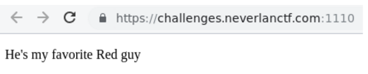
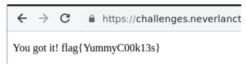

# Cookie Monster (Web)

Hi CTF player. If you have any questions about the writeup or challenge. Submit a issue and I will try to help you understand.

Also I might be wrong on some things. Enjoy :)

(P.S Check out my [CTF cheat sheet](https://github.com/flawwan/CTF-Candy))

## Challenge solution

The page does not contain much..

Looking at the cookies we have a cookie named `Red_Guy's_name=SomeRandomValueThatIdontremember`

Let's set the cookie value to elmo.

