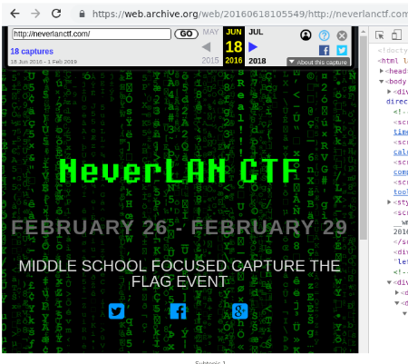
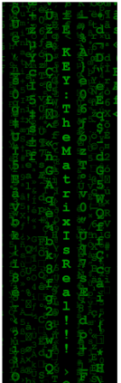

# Let's go way back (Web)

Hi CTF player. If you have any questions about the writeup or challenge. Submit a issue and I will try to help you understand.

Also I might be wrong on some things. Enjoy :)

(P.S Check out my [CTF cheat sheet](https://github.com/flawwan/CTF-Candy))

## Challenge solution

The title of the challenge seem to suggest the way [back machine](https://archive.org/web/).

Nothing interesting in the source of the page... Downloading the matrix image and opening it in gimp I found the flag in the middle.

