# Crazy train (250)

Hi CTF player. If you have any questions about the writeup or challenge. Submit a issue and I will try to help you understand.

Also I might be wrong on some things. Enjoy :)

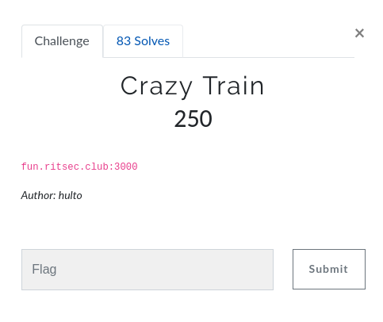

We were the second team to solve this one.

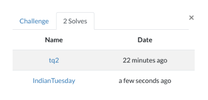

Okay lets begin..

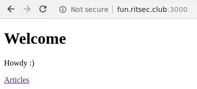

This is the first page. Not much. Lets get the articles

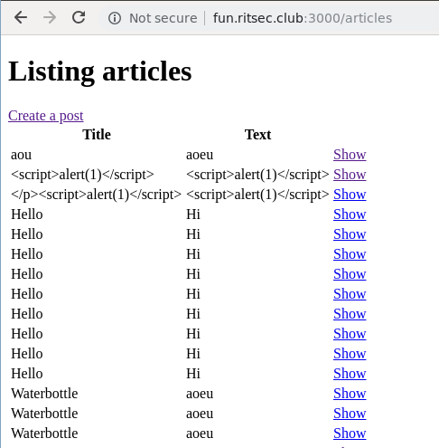

Seem to be some message board. From this I'm pretty sure the flag will not be here as it would be visible to everyone.. Text also seem to be escaped.

Lets look at the source of the page. One thing that stood out was the csrf token.

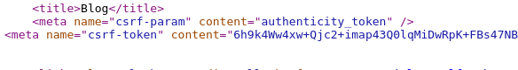

Seems weird. Let's google for `authenticity_token`

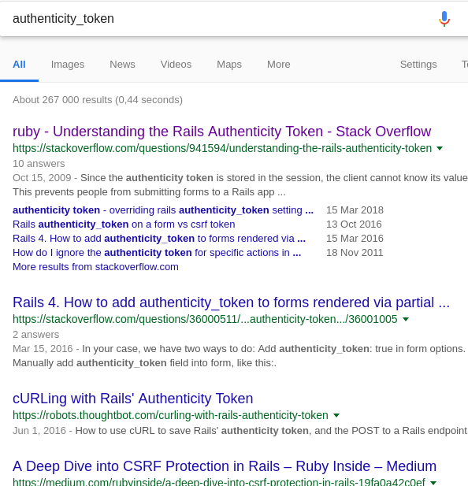

Okay ruby. Interesting. This is probably not the exploit but we gather some very useful information about the application which we can use later.

Moving on. Lets `create a post`

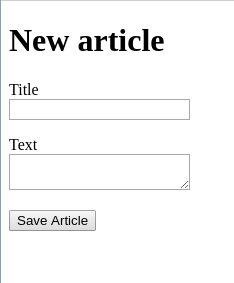

From the message board we know these fields probably does nothing. Lets view the source of the page

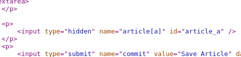

A hidden input field. Interesting. Lets change the field from hidden to a text field so we can enter data.

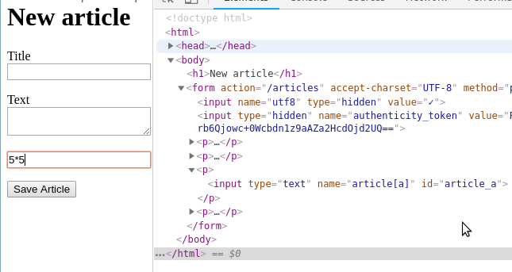

Lets enter 5*5 and save the article.

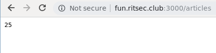

Cool we have command injection

Googling command injection ruby I get

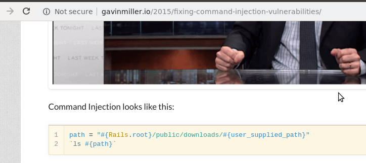

Okay, to execute shell commands, payload should be placed in backticks.

Lets submit a more useful payload.

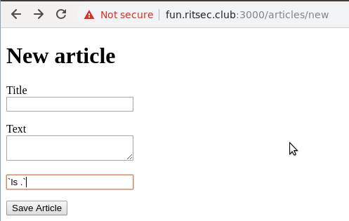

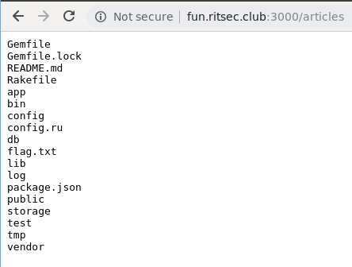

And to view the flag I submit this payload:

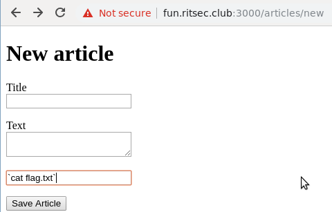

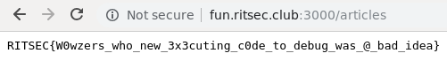
