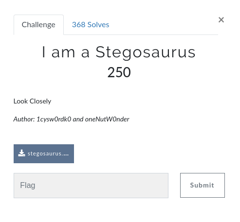
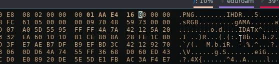
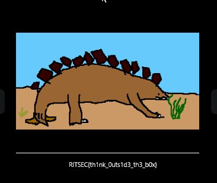

# I am a Stegosaurus (250)

Hi CTF player. If you have any questions about the writeup or challenge. Submit a issue and I will try to help you understand.

Also I might be wrong on some things. Enjoy :)



We are presented with an image (can be downloaded here: https://github.com/flawwan/CTF-Writeups/blob/master/ritsec/iamstegosaurus/stegosaurus.png)

When we try to open the image `eog stegosaurus.png` we get an CRC error.

We can use `pngcheck` to get a verbose output of the errors.

```bash
$ pngcheck stegosaurus.png
stegosaurus.png  CRC error in chunk IHDR (computed 01aae416, expected 93cf1eca)
ERROR: stegosaurus.png
```
Okay we got a CRC Error in the IHDR chunk. Let's correct that.

`hexedit stegosaurus.png`

Use `/` to search for a hex string. Enter the `93cf1eca`

```hex
00000000   89 50 4E 47  0D 0A 1A 0A  00 00 00 0D  49 48 44 52  00 00 01 35  00 00 00 E8  08 02 00 00  00 [start]93 CF 1E  CA[end] 00 00 00  .PNG........IHDR...5................
```

Look between [start] and [end]. There is our checksum that is wrong. To modify it just select the first byte "9" and type the correct checksum "01aae416". This checksum is the one pngcheck calculated for us.



Press [F2] to save and exit with [CTRL-C]

Now lets try open the file with `eog stegosaurus.png`.



