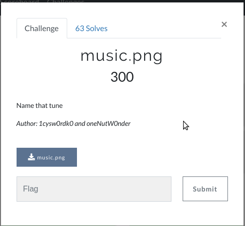
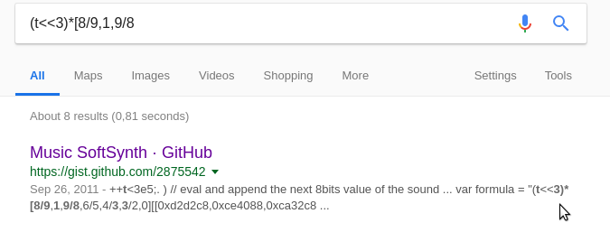
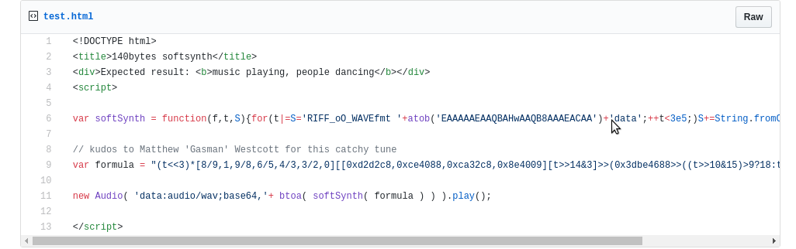
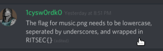

# Music (300)

Hi CTF player. If you have any questions about the writeup or challenge. Submit a issue and I will try to help you understand.

Also I might be wrong on some things. Enjoy :)



(It seems like the challenge authors remade the challenge during the ctf. It seem to have been changed to a .png file... This writeup will be for the original challenge "music.txt")


We are presented with a txt file (can be downloaded here: https://github.com/flawwan/CTF-Writeups/blob/master/ritsec/music/music.txt)

music.txt
```
(t<<3)*[8/9,1,9/8,6/5,4/3,3/2,0]
[[0xd2d2c7,0xce4087,0xca32c7,0x8e4008]
[t>>14&3.1]>>(0x3dbe4687>>((t>>10&15)>9?18:t>>10&15)*3&7.1)*3&7.1]

Wrap your answer in RS{}
```

No idea what this is. Googling parts of it we get:



Music SoftSynth. Seems useful.



Looks very similar to our string.

Lets replace the formula with ours and run the program.

** Plays rick rolled in speakers**

"Name that tune", that's "Never gonna give you up".

The flag format was revealed by the admin in discord.



And the final flag was:
`RITSEC{never_gonna_give_you_up}`
