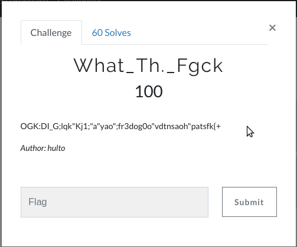
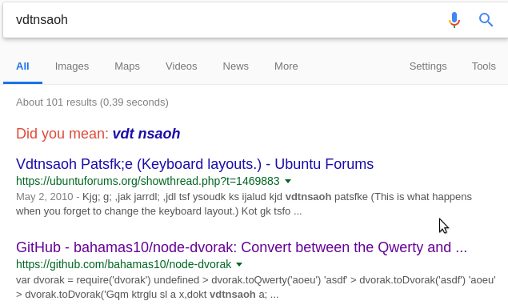
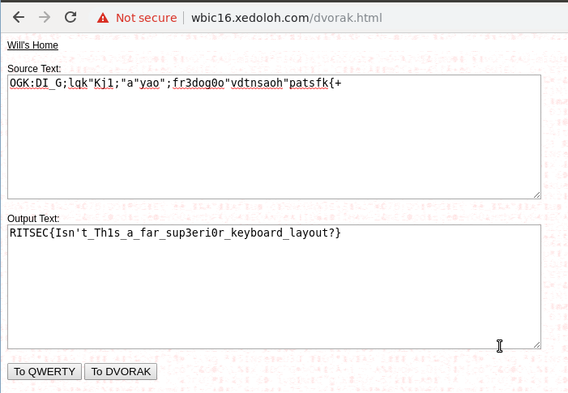

# What_Th.\_Fgck (100)

Hi CTF player. If you have any questions about the writeup or challenge. Submit a issue and I will try to help you understand.

Also I might be wrong on some things. Enjoy :)



```
OGK:DI_G;lqk"Kj1;"a"yao";fr3dog0o"vdtnsaoh"patsfk{+
```

Googling some parts of the string we get the following:



Okay so it seems like the text is written in Dvorak? Never heard of something like this before.

Now we google:

`Qwerty and Dvorak converter online`

We find this converter: http://wbic16.xedoloh.com/dvorak.html.


